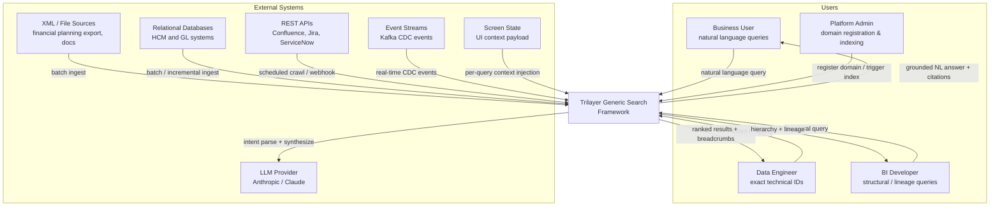
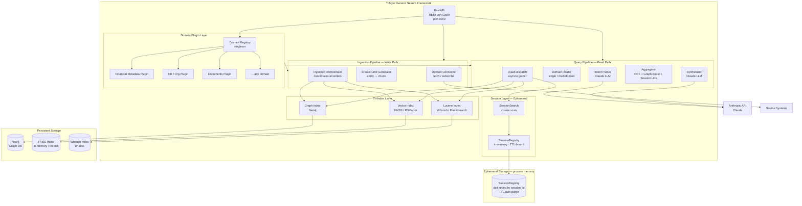

# 01 — System Architecture

---

## 1. Executive Summary

The **Trilayer Generic Search (TGS)** framework is a Python-based search engine that solves the
"Data Discovery Problem" across any structured or semi-structured domain. It combines three
specialised index types — Vector (semantic), Keyword (exact), and Graph (relational) — with
LLM-powered intent routing and grounded synthesis.

The framework is built as a **plugin host**: the search engine is written once; domains
(financial metadata, HR records, compliance controls, documents, code, etc.) are registered as
typed configuration objects that tell the engine how to ingest, index, and search that domain's
data.

---

## 2. System Context (C4 Level 1)



---

## 3. Container Diagram (C4 Level 2)



---

## 4. Architectural Layers

```
┌──────────────────────────────────────────────────────────────────────┐
│  LAYER 0 — API Surface                                               │
│  FastAPI  ·  REST endpoints  ·  OpenAPI spec                         │
├──────────────────────────────────────────────────────────────────────┤
│  LAYER 1 — Domain Plugin Layer                              VARIABLE │
│  DomainRegistry  ·  DomainConfig  ·  SourceConnector                 │
│  EntityTypeRegistry  ·  GraphSchema  ·  BreadcrumbTemplate           │
│  IntentPromptConfig  ·  TriggerConfig                                │
├──────────────────────────────────────────────────────────────────────┤
│  LAYER 2 — Ingestion Pipeline                               FIXED    │
│  IngestionOrchestrator  ·  BreadcrumbGenerator                       │
│  ChangeDetector  ·  NeighbourPropagator                              │
├──────────────────────────────────────────────────────────────────────┤
│  LAYER 3 — Tri-Index Store                                  FIXED    │
│  VectorIndexWriter  ·  LuceneIndexWriter  ·  GraphIndexWriter        │
├──────────────────────────────────────────────────────────────────────┤
│  LAYER 3.5 — Session Layer                                  FIXED    │
│  SessionRegistry (in-memory · TTL)  ·  SessionSearch                 │
│  SessionChunk  ·  SessionLinkBoostingAggregator                      │
│  Feeds: screen context · live API responses · dynamic results        │
├──────────────────────────────────────────────────────────────────────┤
│  LAYER 4 — Query Pipeline                                   FIXED    │
│  IntentParser  ·  DomainRouter  ·  QuadDispatch                      │
│  VectorSearch  ·  LuceneSearch  ·  GraphSearch  ·  SessionSearch     │
├──────────────────────────────────────────────────────────────────────┤
│  LAYER 5 — Aggregation Pipeline                             FIXED    │
│  RRFAggregator  ·  GraphBoostingAggregator                           │
│  SessionLinkBoostingAggregator  ·  (extensible chain)                │
├──────────────────────────────────────────────────────────────────────┤
│  LAYER 6 — LLM Services                                     FIXED    │
│  LLMClient (abstract)  ·  AnthropicClient                            │
│  IntentParser  ·  Synthesizer  ·  LLMJudge (eval)                   │
└──────────────────────────────────────────────────────────────────────┘
```

**VARIABLE** layers contain domain-specific code. **FIXED** layers are written once and
reused across all domains.

---

## 5. Technology Stack

| Concern | Technology | Rationale |
|---|---|---|
| API framework | FastAPI | Async-native, auto OpenAPI, consistent with POC |
| Vector index (default) | FAISS CPU | Zero-infra, fast ANN; swappable to PGVector |
| Vector index (alt) | PGVector + PostgreSQL | Persistent, supports filtered search; POC 3 target |
| Keyword index (default) | Whoosh | Pure Python, zero-infra, on-disk persistence |
| Keyword index (alt) | Elasticsearch | Production-grade; same interface |
| Graph database | Neo4j 5.x | Native property graph; Cypher; persistent |
| Session store | Python `dict` + `asyncio.Lock` | Zero-dependency; process-memory; TTL-purged |
| Embeddings | sentence-transformers (`all-MiniLM-L6-v2`) | 384-dim; CPU-fast; no API key; domain-tunable |
| LLM | Anthropic Claude | Intent parse + synthesis; abstracted behind interface |
| Orchestration | LangGraph | Typed state machine; visualisable; extensible nodes |
| Language | Python 3.11+ | Consistent with existing POC |
| Container | Docker Compose | Neo4j + app isolated network |

---

## 6. Deployment Topology

```
┌─────────────────────────────────────────────────────┐
│  Docker Compose Network: tgs_network                │
│                                                     │
│  ┌──────────────────────┐  ┌─────────────────────┐  │
│  │  tgs-app             │  │  neo4j              │  │
│  │  FastAPI :8000       │  │  Bolt   :7687       │  │
│  │  + all index writers │  │  HTTP   :7474       │  │
│  │  + LangGraph         │  │  Volume: neo4j_data │  │
│  └──────────────────────┘  └─────────────────────┘  │
│                                                     │
│  Volumes:                                           │
│    neo4j_data   (persistent graph)                  │
│    faiss_data   (optional: persisted FAISS)         │
│    whoosh_data  (persistent Lucene index)            │
│    domain_data  (source files, connector caches)    │
└─────────────────────────────────────────────────────┘
```

---

## 7. Key Architectural Decisions

### ADR-001: Plugin-over-configuration
**Decision:** Domains are Python classes implementing interfaces, not YAML/JSON config files.
**Rationale:** Static typing catches misconfiguration at import time; IDEs provide autocomplete;
complex logic (e.g., custom breadcrumb generators) is natural in code.
**Trade-off:** Requires a Python deployment per plugin; no hot-reload of plugins at runtime.

### ADR-002: Namespace isolation per domain
**Decision:** Each domain gets its own Neo4j label prefix, FAISS partition, and Whoosh index directory.
**Rationale:** Prevents cross-domain result contamination; allows per-domain index operations
(re-index one domain without touching others).
**Trade-off:** Cross-domain graph traversal requires explicit opt-in bridge relationships.

### ADR-003: Post-processor chain for aggregation
**Decision:** Aggregation is an ordered list of `ResultPostProcessor` implementations, not a
single class.
**Rationale:** New re-ranking or filtering stages (access control, reranker model, time decay)
can be inserted without modifying existing aggregators.
**Trade-off:** Ordering matters; misconfigured chains are a runtime failure, not compile-time.

### ADR-004: Screen context is query-time injection, not pre-indexed
**Decision:** Screen state (what the user is currently viewing in the UI) is passed in the search
request body and injected into the intent parser prompt — it is never written to any index.
**Rationale:** Screen state is ephemeral and user-specific; indexing it would create unbounded
write amplification.
**Trade-off:** Screen context only influences intent parsing and query scoping, not index
content.

### ADR-005: LLM client is an abstract interface
**Decision:** All LLM calls go through `LLMClient(ABC)`; `AnthropicLLMClient` is the default.
**Rationale:** Swap to OpenAI, local Ollama, or any LangChain-compatible model without changing
any business logic.
**Trade-off:** Structured output (JSON mode) may behave differently across providers; each
adapter must handle provider-specific quirks.

### ADR-006: Session Layer as an ephemeral fourth index
**Decision:** A `SessionRegistry` holds `SessionChunk` objects in process memory, keyed by
`session_id`, with a configurable TTL (default 30 minutes). `SessionSearch` participates in
the same quad-dispatch as the three permanent indices. Session chunks carry `linked_permanent_ids`
— references to permanent chunks they are derived from — and a dedicated
`SessionLinkBoostingAggregator` amplifies those linked permanents during RRF merge.
**Rationale:** Some data is too dynamic or user-specific to ever be written to a persistent
index (screen state, live API responses, per-session annotations) but must still influence
retrieval ranking and synthesis. The session layer makes this possible without any write
amplification to permanent storage.
**Trade-off:** Session state is process-local — it does not survive app restarts and cannot be
shared across horizontally-scaled replicas without an external session store (Redis). Ephemeral
chunks are clearly labelled as `"live context"` in synthesis output so users know the citation
is session-scoped, not persisted.
