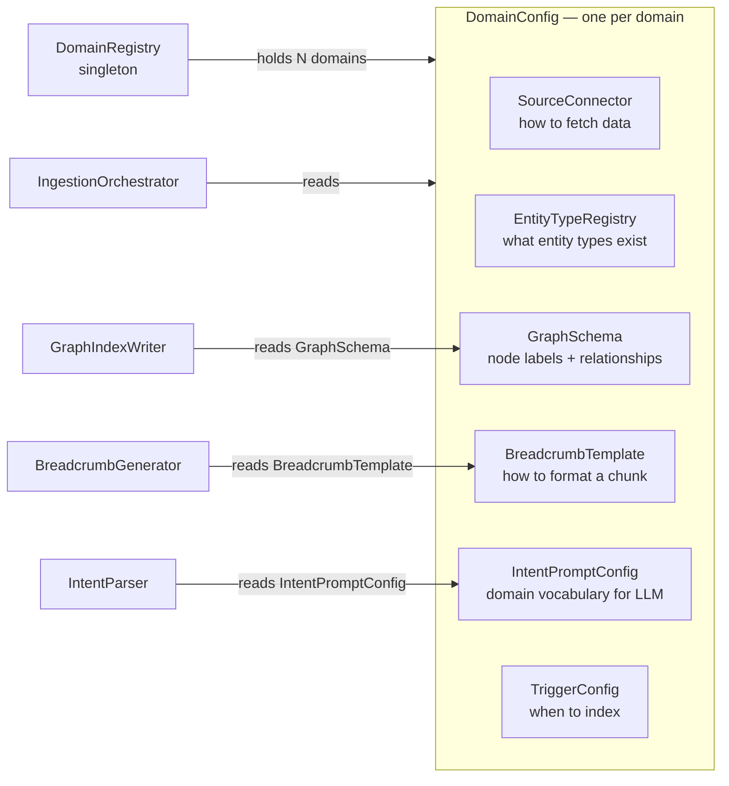
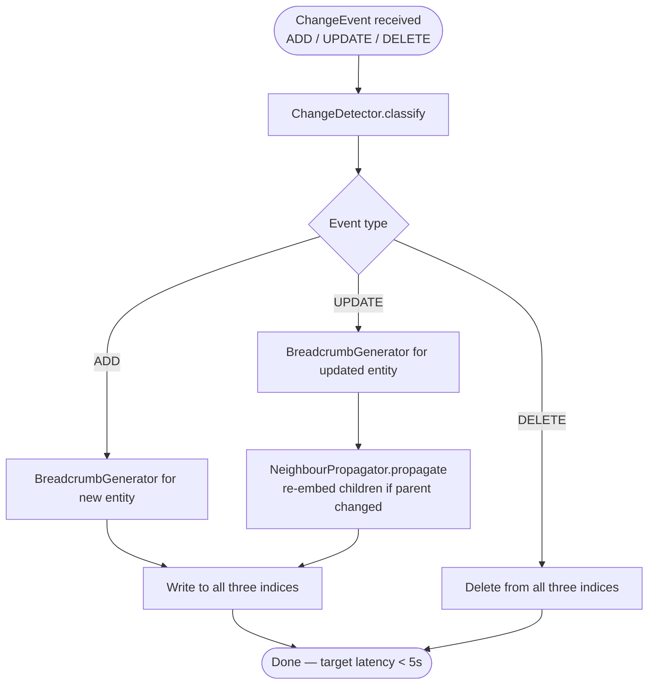
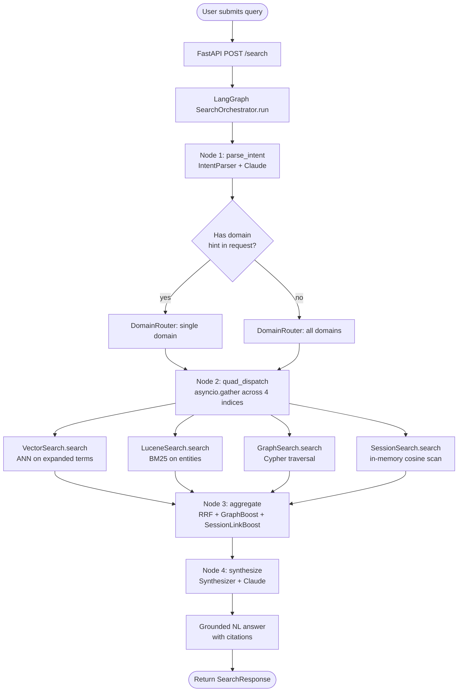

# 02 — High-Level Design

---

## 1. Component Overview

The framework has two independent pipelines sharing the same index layer:

```
WRITE PATH (Ingestion)          READ PATH (Query)
─────────────────────          ─────────────────
Source Systems                 User / Application
      │                               │
SourceConnector                  API Layer
      │                               │
BreadcrumbGenerator           Intent Parser (LLM)
      │                               │
IngestionOrchestrator         Domain Router
   ┌──┼──┐                      ┌──┼──┐
   │  │  │                      │  │  │
 Vec Luc Graph              Vec Luc Graph
 Idx Idx Idx                Srch Srch Srch
   └──┼──┘                      └──┼──┘
      │                               │
  [INDICES]                    Aggregator (RRF + Boost)
                                       │
                               Synthesizer (LLM)
                                       │
                               Grounded NL Answer
```

---

## 2. Domain Plugin Model

A **Domain** is a self-contained bundle of configuration that teaches the engine
everything it needs to know about one type of data.



### Built-in Domain Plugins (initial set)

| Plugin | Data | Source Type |
|---|---|---|
| `FinancialMetadataPlugin` | Accounts, Versions, Sheets, Dimensions | XML file / planning system API |
| `HRPlugin` | Employees, Departments, Roles, Competencies | REST API / HCM DB |
| `CompliancePlugin` | Controls, Risks, Processes, Findings | REST API / SQL |
| `DocumentPlugin` | Policies, SOPs, Guides, Confluence pages | File system / REST API |
| `ScreenContextPlugin` | Current UI visible entities | Request-time injection (no indexing) |

---

## 3. Write Path — Ingestion Pipeline

### 3.1 Batch Ingestion

```mermaid
flowchart TD
    A([Trigger: POST /domains/{id}/index\nor startup\nor schedule]) --> B

    B[SourceConnector.fetch_all] --> C[Iterator of RawEntity objects]
    C --> D[BreadcrumbGenerator.generate\nentity → MetadataChunk]
    D --> E{Entity has\nrelationships?}
    E -->|yes| F[Extract RawRelationship list]
    E -->|no| G
    F --> G[IngestionOrchestrator fan-out]

    G --> H[VectorIndexWriter.index\nentities in batches]
    G --> I[LuceneIndexWriter.index\nentities in batches]
    G --> J[GraphIndexWriter.index\nMERGE nodes + edges]

    H --> K[IngestionResult]
    I --> K
    J --> K
    K --> L([Return: counts + latency + errors])
```

### 3.2 Incremental / CDC Ingestion



### 3.3 Screen Context — No Indexing

Screen state is not ingested. It is passed in the search request body:

```json
{
  "query": "why is COGS high this quarter?",
  "screen_context": {
    "visible_accounts": ["COGS", "DIRECT_MATERIAL", "DIRECT_LABOR"],
    "active_version": "ACTUAL",
    "active_level": "DIVISION",
    "time_period": "Q1_2026"
  }
}
```

The intent parser receives this as additional context and uses it to scope the search
without any index write.

---

## 4. Read Path — Query Pipeline

### 4.1 Full Pipeline



### 4.2 Intent Classification

The intent parser classifies every query into one of three shapes:

| Query Type | Signal | Index Emphasis |
|---|---|---|
| `LOOKUP` | ALL_CAPS identifiers, specific codes, exact names | Lucene first; vector + graph for context |
| `DISCOVERY` | Business concepts, fuzzy language, exploratory | Vector first; lucene + graph for precision |
| `TRAVERSAL` | "children of", "parent of", "hierarchy", "lineage", "depends on" | Graph first; vector + lucene for candidate filtering |

### 4.3 Multi-Domain Search

When no domain is specified:

```
Query
  │
  ▼
IntentParser detects domain signals
  │
  ├── If strong domain signal → route to that domain
  └── If ambiguous → fan out to ALL registered domains
         ├── Domain A: tri-dispatch → results_A
         ├── Domain B: tri-dispatch → results_B
         └── Domain N: tri-dispatch → results_N
                │
                ▼
         Cross-domain RRF merge
         (domain_weight × individual_score)
                │
                ▼
         Synthesizer gets breadcrumbs from multiple domains
         (each breadcrumb carries its domain as part of lineage)
```

### 4.4 Screen Context Injection

```
Request body contains screen_context
         │
         ▼
IntentParser receives:
  - user query
  - screen_context dict injected into system prompt

Effect:
  - Entities visible on screen are added to intent.entities
  - Active version/level/period becomes intent.structural_filter
  - Query is scoped to visible scope automatically

Example:
  Query: "why is this high?"
  Screen: { visible_accounts: ["COGS"], active_version: "ACTUAL" }
  → Parsed as: DISCOVERY on COGS within ACTUAL version
```

---

## 5. Aggregation Pipeline

The aggregation stage is an **ordered chain of post-processors**. Each processor
receives the merged list and returns a (potentially modified) list.

```
Default chain:
  RRFAggregator → GraphBoostingAggregator → SessionLinkBoostingAggregator

Future extensions (slot in without changing existing code):
  RRFAggregator → GraphBoostingAggregator → SessionLinkBoostingAggregator
      → CrossEncoderReranker → AccessControlFilter
```

### RRF Formula

```
rrf_score(item) = Σ  1 / (k + rank_i(item))
                 i ∈ {vector, lucene, graph, session}

where k = 60 (default; configurable per domain)
Session results participate in RRF alongside permanent results.
```

### Graph Boosting

```
1. Take top-N Lucene results (high-precision exact matches)
2. Fetch their 1-hop neighbours via graph (edge types from domain's GraphSchema.boost_edges)
3. Apply boost_factor multiplier to any neighbour also in the merged list
4. Re-sort the merged list by boosted score
```

### Session Link Boosting

```
1. Take all session results that have linked_permanent_ids
2. For each linked permanent chunk_id in the merged list:
   a. Apply session_link_boost_factor multiplier (default 1.3×)
   b. Mark as boost_applied=True with source="session_link"
3. Session chunks themselves appear in results labelled as "live context"
4. Re-sort the merged list by boosted scores
```

---

## 6. Session Layer

The Session Layer is an **ephemeral, per-session fourth index** that participates in quad-dispatch
alongside the three permanent indices. It bridges the gap between data that is too dynamic to
persist and data that already lives in the permanent indices.

### What feeds the Session Layer

| Source | How it enters the Session Layer |
|---|---|
| **Screen context** | Entities visible on the current UI screen are materialised as `SessionChunk` objects at query time, linked to their permanent counterparts by `chunk_id` |
| **Live API responses** | A connector fetches real-time data (e.g., current account balance from the financial planning system) mid-query; the response is wrapped as a `SessionChunk` and injected |
| **Dynamic search results** | Results from a prior query in the same session can be re-injected as session chunks, giving the next query access to "what we already found" |
| **User annotations** | Explicit user context ("I'm working on the EMEA Q2 close") stored per session |

### Session Chunk Lifecycle

```
Session created (POST /sessions)
        │
        ▼
SessionChunk written on query (screen context materialised)
or on upload (live API result wrapped)
        │
        ▼
SessionSearch scans in-memory chunks during quad-dispatch
        │
        ▼
SessionLinkBoostingAggregator boosts linked permanent chunks
        │
        ▼
Synthesis labels session chunks as "live context" (not persisted)
        │
        ▼
TTL expires (default 30 min) → SessionRegistry.purge_expired()
```

### Linking Session Chunks to Permanent Chunks

When a session chunk is created from screen context, it is linked to the permanent
chunk in the vector/lucene/graph indices by its `chunk_id`. This link is bidirectional
in effect: the session chunk participates in search, and its permanent counterpart
receives a score boost via `SessionLinkBoostingAggregator`.

```
screen_context.visible_accounts = ["COGS", "REVENUE"]
        │
        ▼
SessionRegistry.materialise_screen_context(session_id, visible_accounts)
        │
        ├── Lookup permanent chunk_id for "COGS"  → "financial_metadata::Account::COGS"
        ├── Lookup permanent chunk_id for "REVENUE" → "financial_metadata::Account::REVENUE"
        │
        ▼
SessionChunk(
    chunk_id="session::abc123::screen::COGS",
    linked_permanent_ids=["financial_metadata::Account::COGS"],
    source_type=SCREEN_CONTEXT,
    ttl_seconds=1800
)
```

---

## 7. Extensibility Points Summary

| Extension Point | How to Add |
|---|---|
| New domain | Implement `DomainConfig` and register via `DomainRegistry.register()` |
| New source type | Implement `SourceConnector` (two methods: `fetch_all`, `fetch_since`) |
| New index backend | Implement `IndexWriter` + `IndexReader` interfaces; swap in config |
| New aggregation stage | Implement `ResultPostProcessor`; append to domain's `aggregation_chain` |
| New LLM provider | Implement `LLMClient`; inject into `IntentParser` and `Synthesizer` |
| New pre-processing stage | Implement `QueryPreProcessor`; prepend to the query pipeline chain |
| Additional index layer | Add a new `IndexWriter`/`IndexReader` pair; add a dispatch slot in `QuadDispatch` |
| Session layer sources | Call `SessionRegistry.add_chunk()` from any connector or route handler |
| Session link boost tuning | Adjust `session_link_boost_factor` in `DomainConfig` per domain |

---

## 7. Data Flow Summary

```
                    WRITE PATH                        READ PATH
                    ──────────                        ─────────

Source ──► RawEntity ──► MetadataChunk         Query + session_id
                              │                  │
                    ┌─────────┼─────────┐        ▼
                    │         │         │     ParsedIntent
                  FAISS    Whoosh    Neo4j       │
                    │         │         │    ┌───┼───┬────────┐
                    └─────────┼─────────┘    │   │   │        │
                              │             Vec Luc Graph  Session
                          [INDICES]          │   │   │        │
                                            └───┼───┴────────┘
                    Screen/API/Annotation        │
                    ──► SessionChunk ────►  Merged + Boosted
                        (linked to            (Graph + Session
                         permanent)            link boost)
                                                │
                                           Breadcrumbs → LLM
                                           (session chunks
                                            labelled "live")
                                                │
                                           Grounded Answer
```
