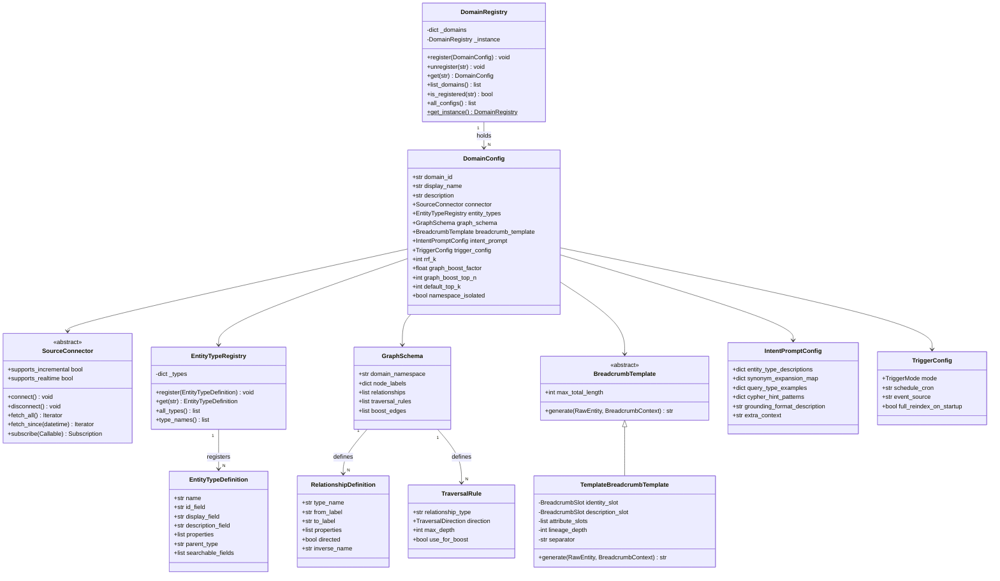
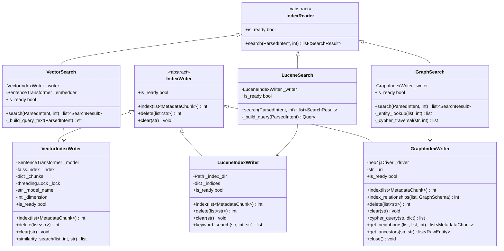
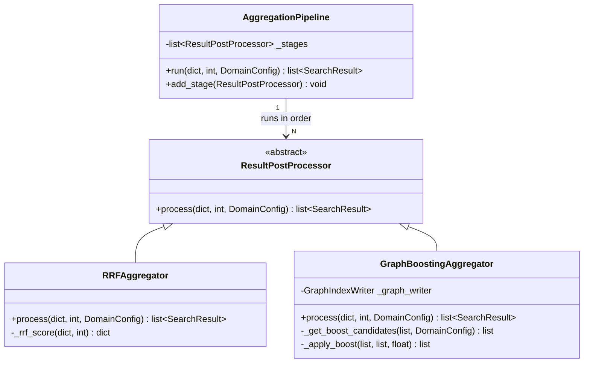
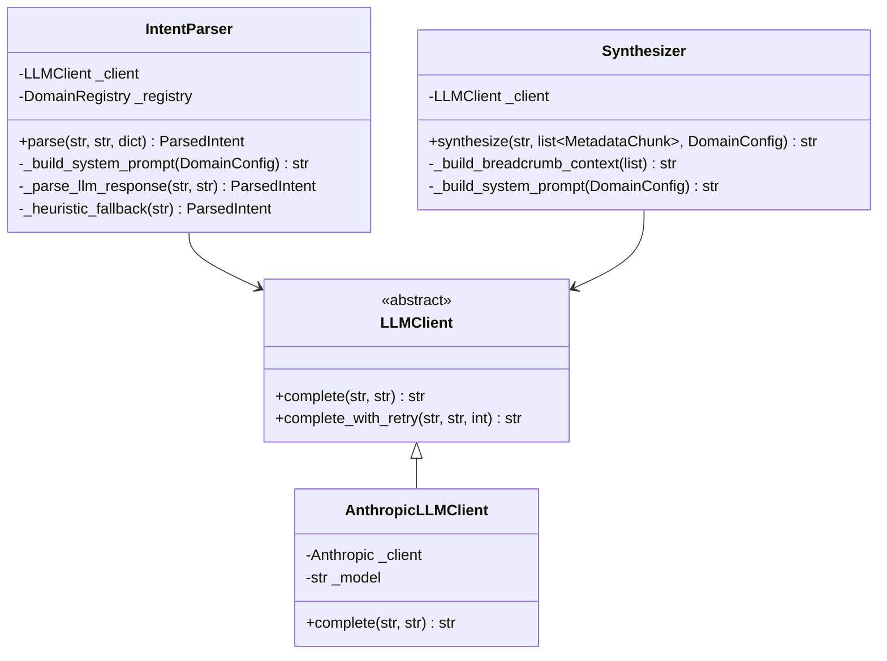
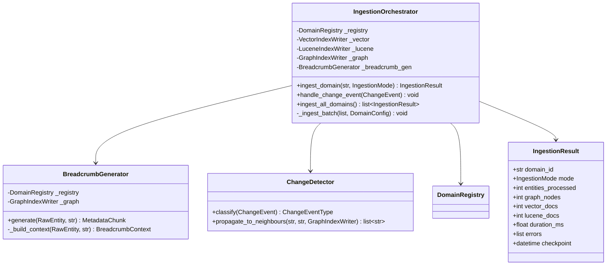
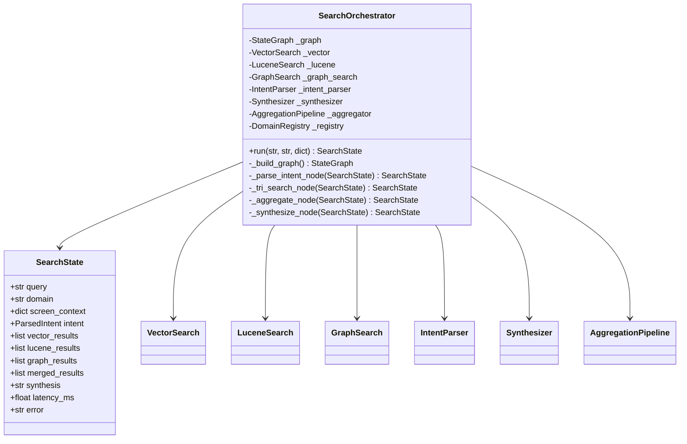
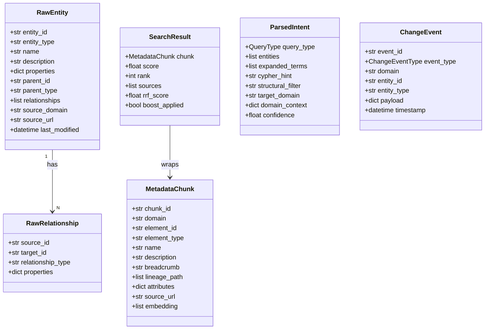
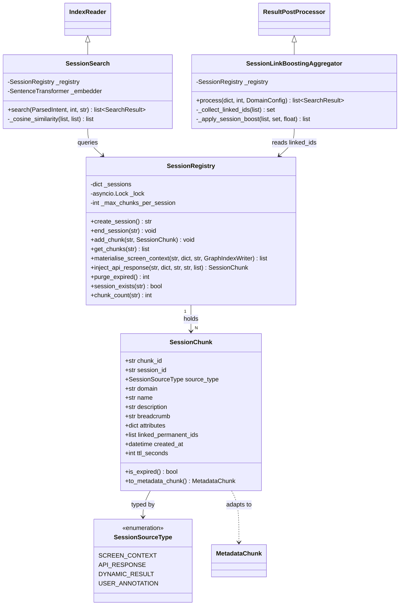

# 05 — Class Diagrams

---

## 1. Domain Plugin Layer

---

## 2. Source Connector Hierarchy

```mermaid
classDiagram
    class SourceConnector {
        <<abstract>>
        +connect() void
        +disconnect() void
        +fetch_all() Iterator~RawEntity~
        +fetch_since(datetime) Iterator~RawEntity~
        +subscribe(Callable) Subscription
        +supports_incremental bool
        +supports_realtime bool
    }

    class XMLFileConnector {
        -Path file_path
        -EntityTypeRegistry entity_types
        +connect() void
        +disconnect() void
        +fetch_all() Iterator~RawEntity~
        +fetch_since(datetime) Iterator~RawEntity~
        +supports_incremental bool
    }

    class DatabaseConnector {
        -str connection_string
        -dict table_mappings
        -Engine _engine
        +connect() void
        +disconnect() void
        +fetch_all() Iterator~RawEntity~
        +fetch_since(datetime) Iterator~RawEntity~
        +supports_incremental bool
    }

    class RESTAPIConnector {
        -str base_url
        -dict auth_config
        -dict endpoint_mappings
        -httpx.AsyncClient _client
        +connect() void
        +disconnect() void
        +fetch_all() Iterator~RawEntity~
        +fetch_since(datetime) Iterator~RawEntity~
        +supports_incremental bool
    }

    class FileSystemConnector {
        -Path watch_dir
        -list supported_mimes
        -TextExtractor _extractor
        +connect() void
        +disconnect() void
        +fetch_all() Iterator~RawEntity~
        +fetch_since(datetime) Iterator~RawEntity~
        +process_upload(bytes, str, str) Iterator~RawEntity~
        +supports_incremental bool
    }

    class EventStreamConnector {
        -str broker_url
        -str topic
        -KafkaConsumer _consumer
        +connect() void
        +disconnect() void
        +fetch_all() Iterator~RawEntity~
        +fetch_since(datetime) Iterator~RawEntity~
        +subscribe(Callable) Subscription
        +supports_realtime bool
    }

    class ScreenContextConnector {
        +fetch_all() Iterator~RawEntity~
        +fetch_since(datetime) Iterator~RawEntity~
        +from_request_context(dict) Iterator~RawEntity~
    }

    SourceConnector <|-- XMLFileConnector
    SourceConnector <|-- DatabaseConnector
    SourceConnector <|-- RESTAPIConnector
    SourceConnector <|-- FileSystemConnector
    SourceConnector <|-- EventStreamConnector
    SourceConnector <|-- ScreenContextConnector
```

---

## 3. Index Layer

---

## 4. Aggregation Pipeline

---

## 5. LLM Layer

---

## 6. Ingestion Pipeline

---

## 7. Search Orchestrator (LangGraph)

---

## 8. Core Data Models

---

## 9. Session Layer

