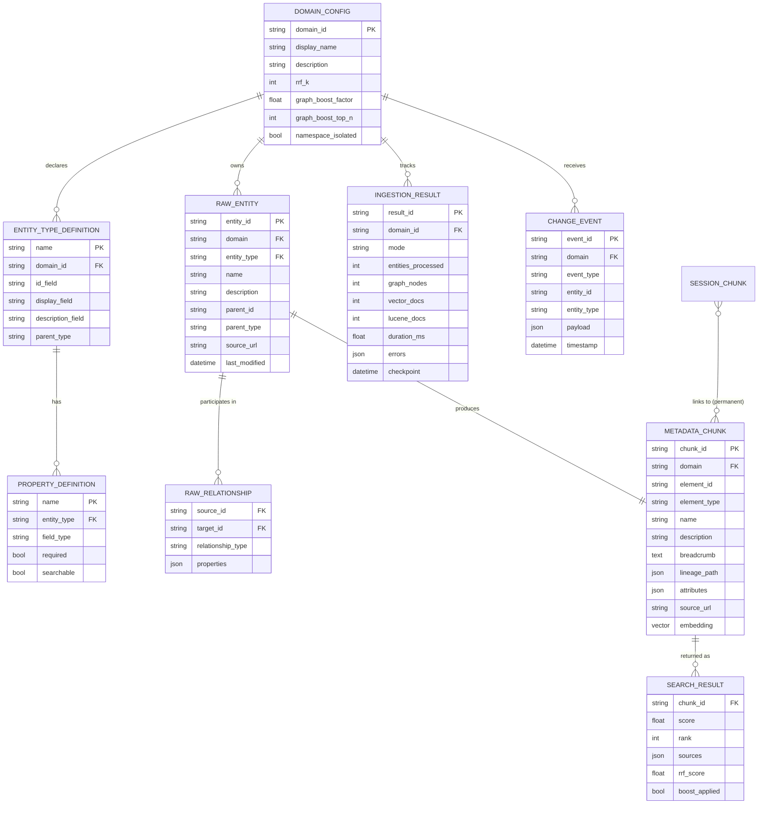
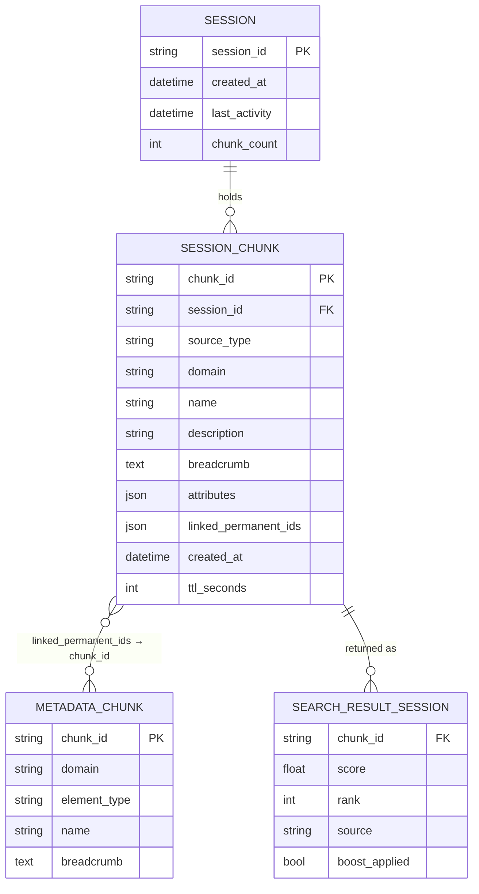
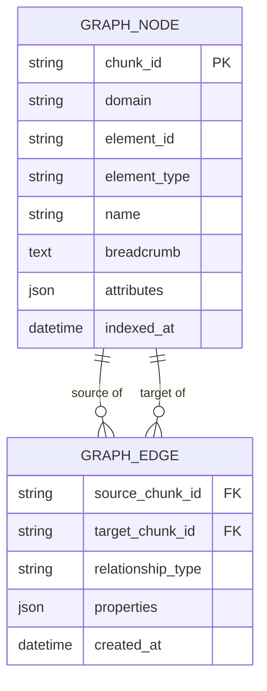
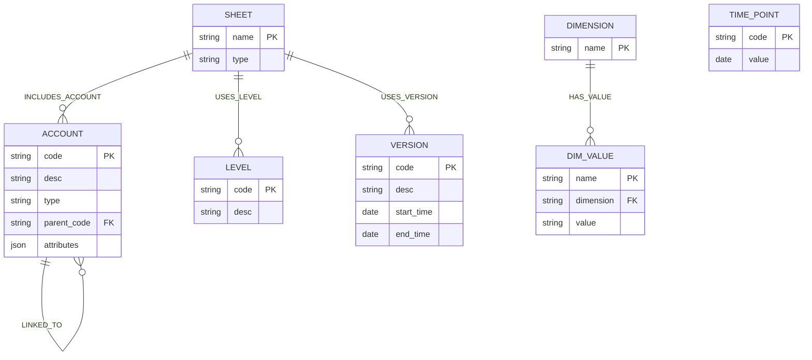
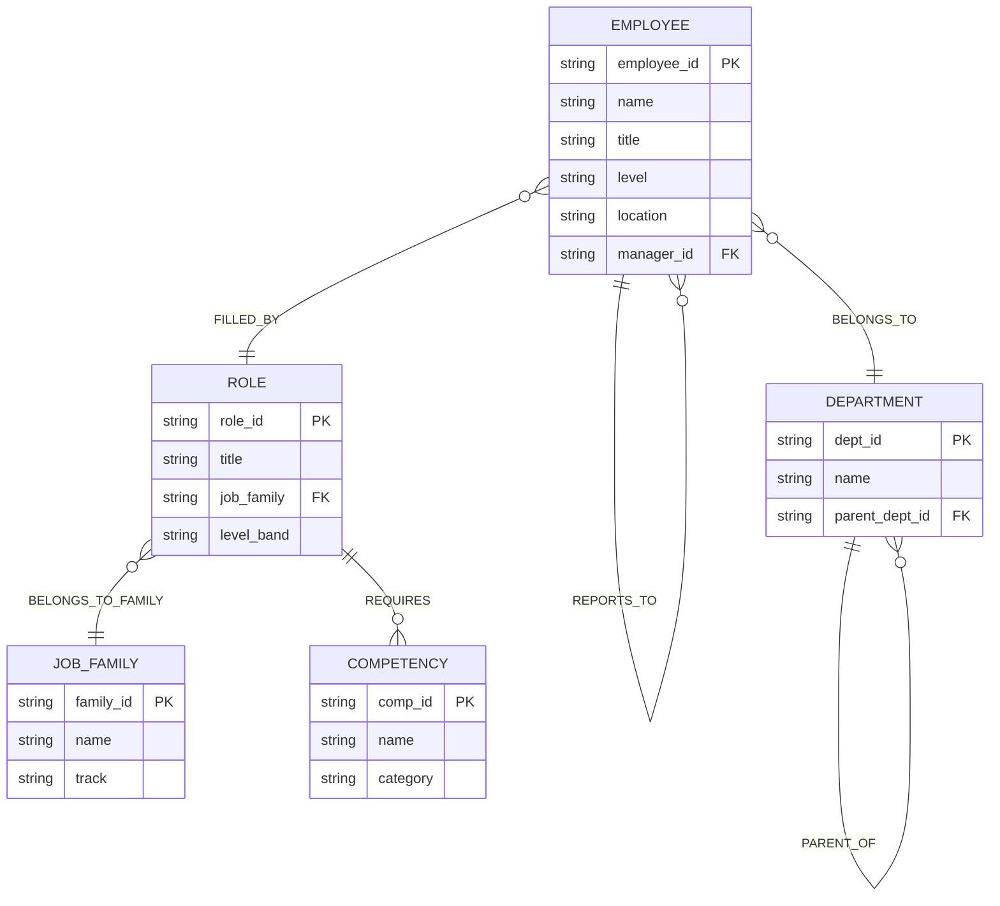
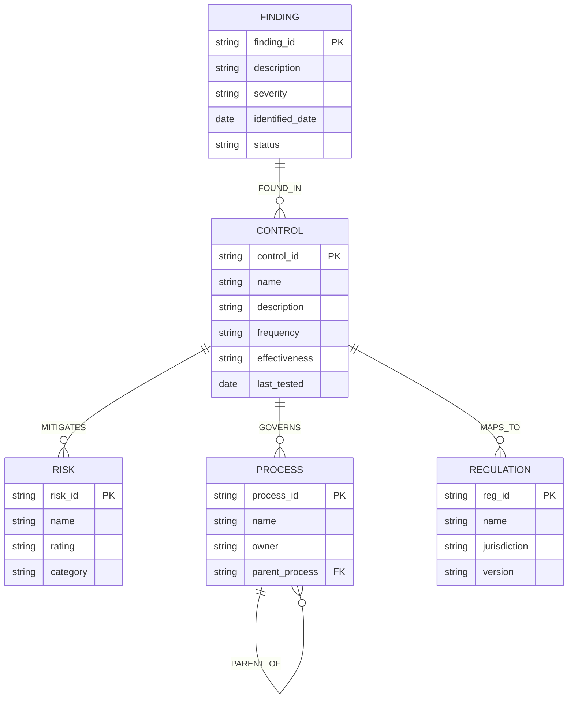
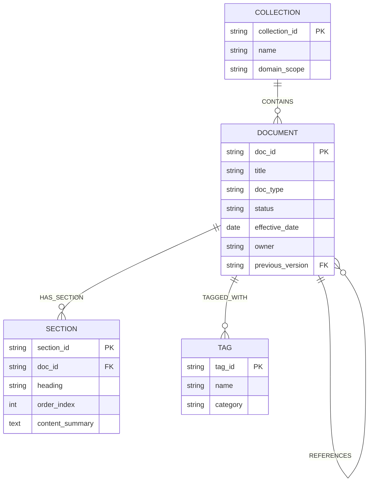
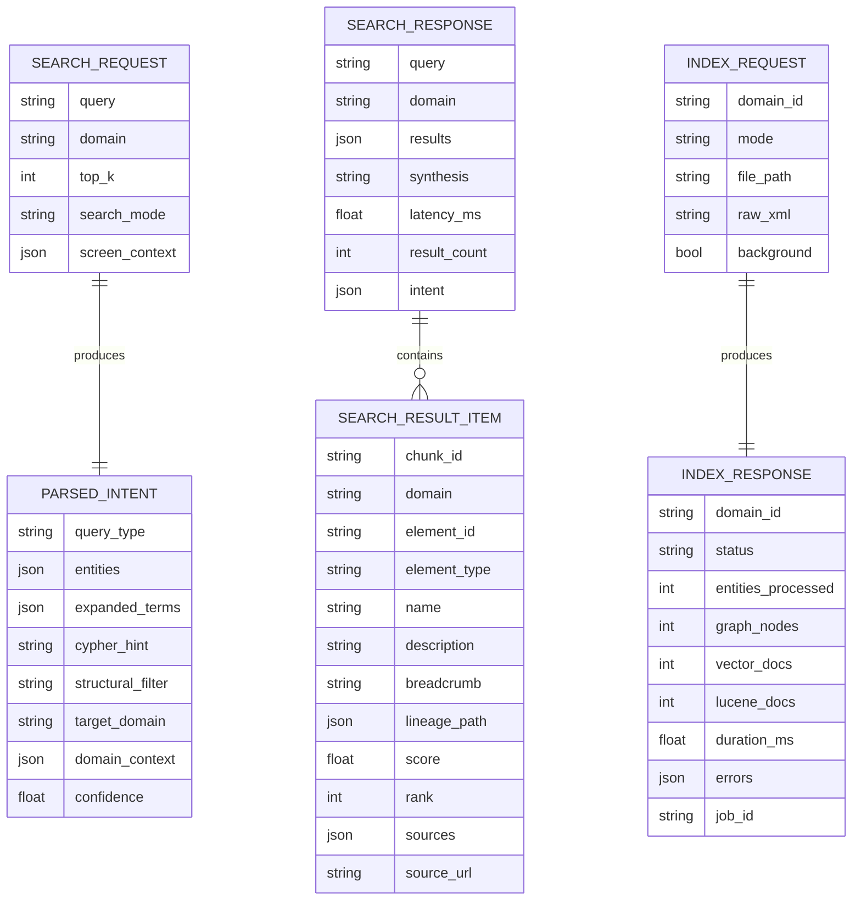
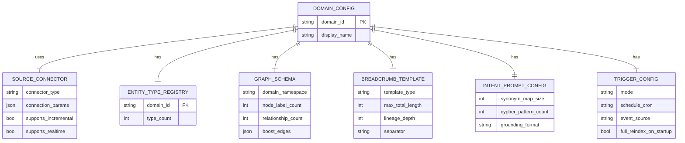

# 06 — Entity Diagrams

---

## 1. Canonical Data Model

The entities that flow through the framework, regardless of domain.



---

## 5. Session Layer Data Model



### Session Source Types and Their Linked Permanent IDs

```
SessionSourceType        Example linked_permanent_ids
─────────────────        ─────────────────────────────────────────────
SCREEN_CONTEXT           ["financial_metadata::Account::COGS",
                          "financial_metadata::Account::REVENUE"]

API_RESPONSE             ["financial_metadata::Account::SAAS_REVENUE"]
(live balance data)

DYNAMIC_RESULT           chunk_ids from previous query's merged_results

USER_ANNOTATION          user-specified entity chunk_ids
("I'm working on EMEA")  ["financial_metadata::DimValue::EMEA"]
```

---

## 2. Neo4j Graph Node / Edge Model

The physical model inside Neo4j. Domain namespace is prefixed to all labels
(e.g., `financial_metadata_Account`, `hr_Employee`).



### Example: Financial Metadata Domain Graph



### Example: HR Domain Graph



### Example: Compliance Domain Graph



### Example: Document Domain Graph



---

## 3. API Request / Response Models



---

## 4. Domain Config Composition Model

Shows how all config parts compose into a registered domain.


