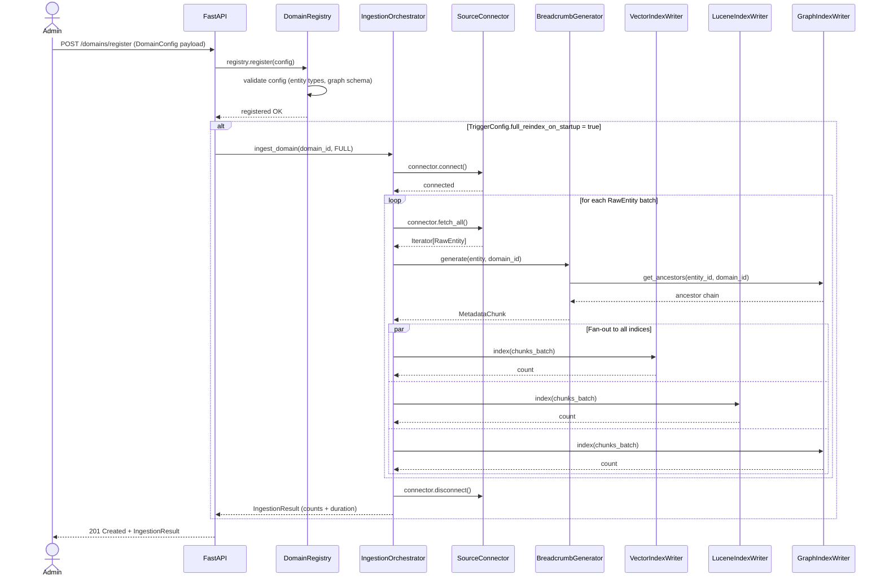
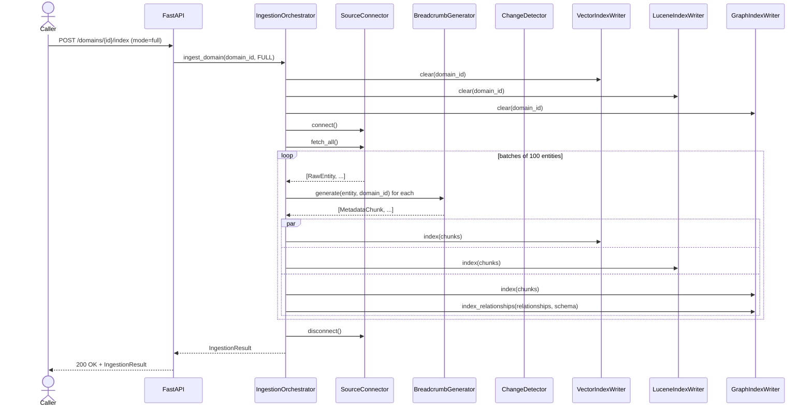
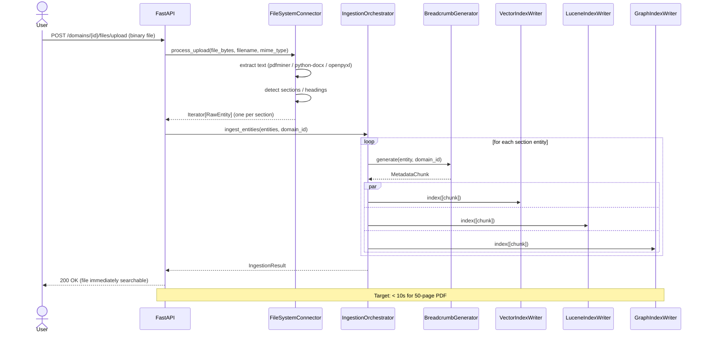
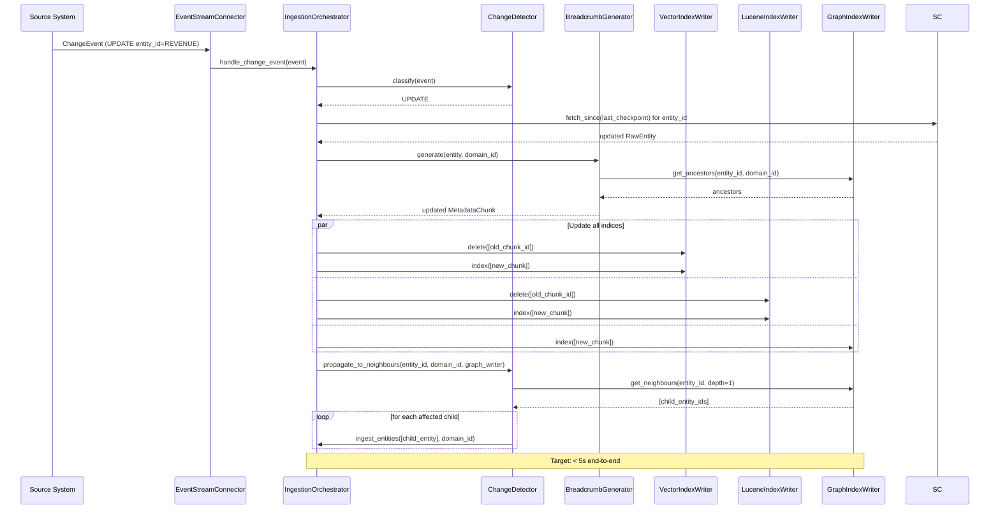
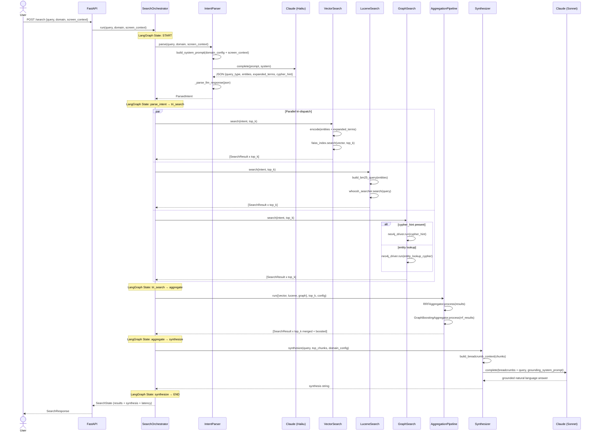
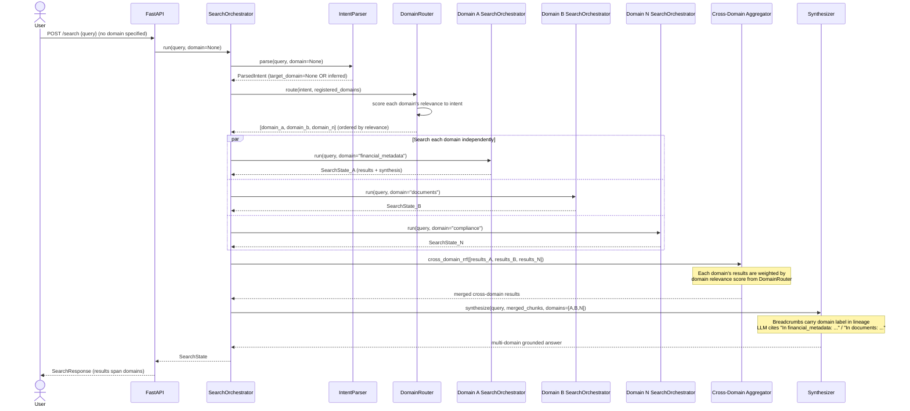
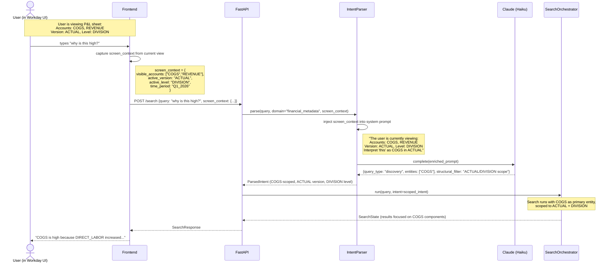
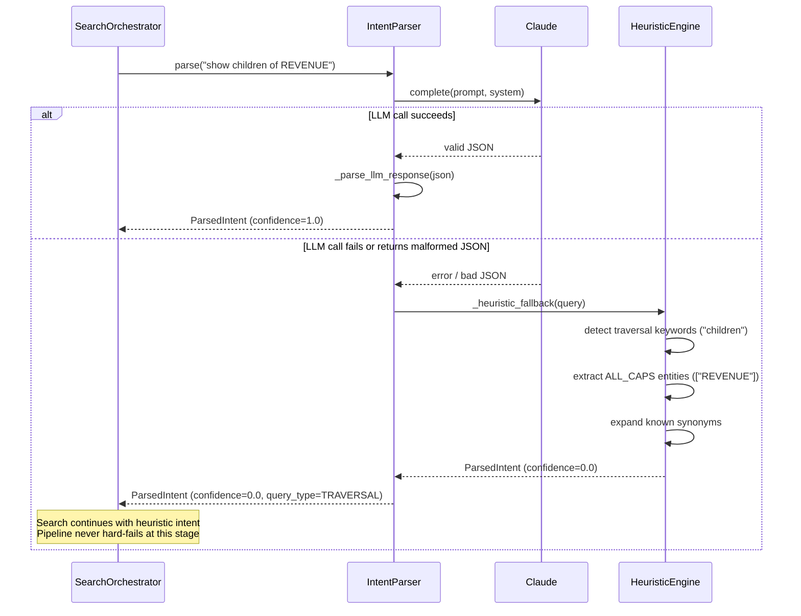
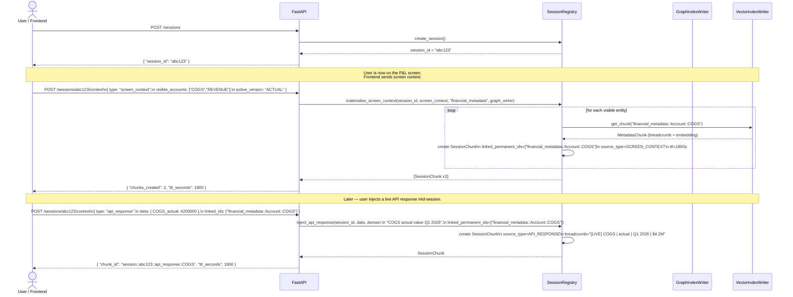
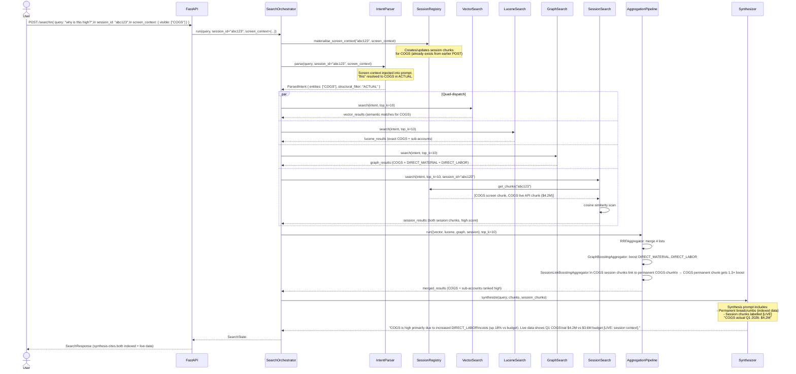

# 07 — Sequence Diagrams

---

## 1. Domain Registration

---

## 2. Full Batch Ingestion

---

## 3. On-Upload File Indexing

---

## 4. Real-Time CDC Update (Incremental)

---

## 5. Single-Domain Search (Full Pipeline)

---

## 6. Multi-Domain Search

---

## 7. Screen Context Search

---

## 8. LLM Fallback (Heuristic)

---

## 9. Session Creation and Context Injection

---

## 10. Session-Aware Search (Quad-Dispatch)

