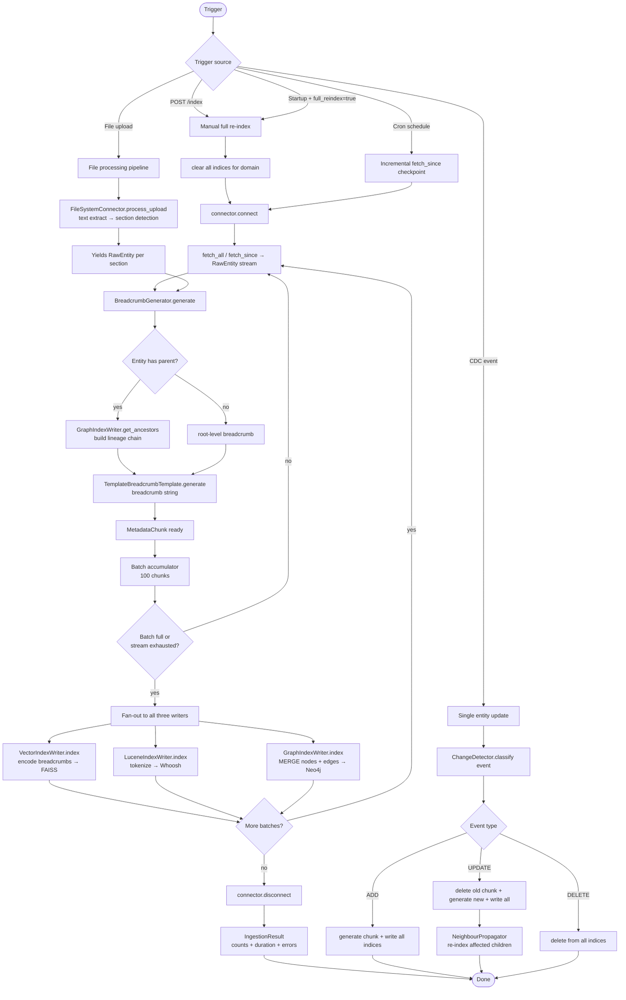
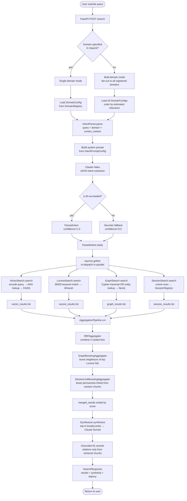
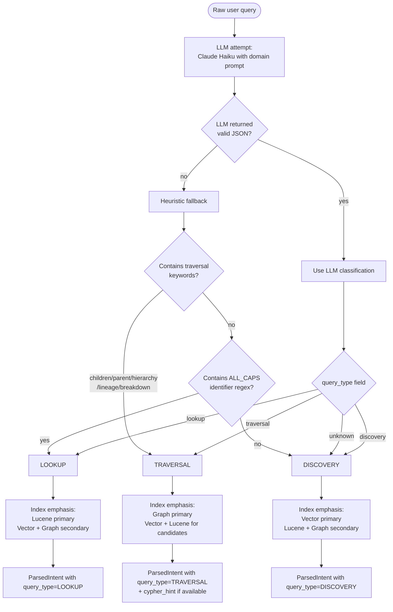
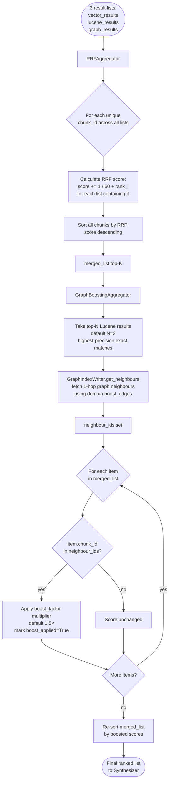
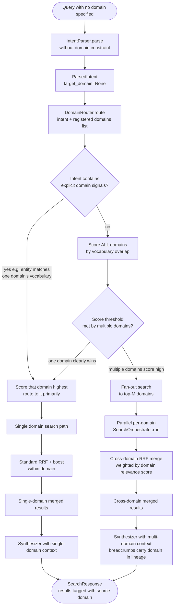
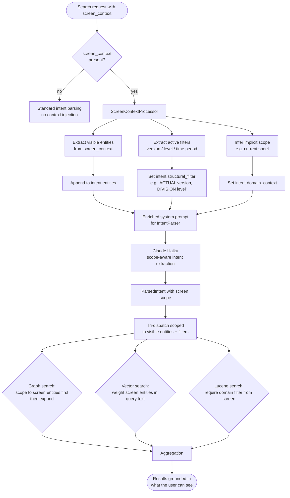
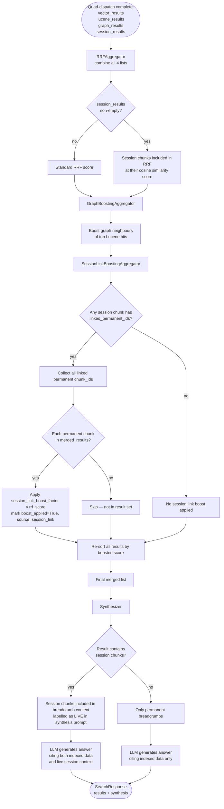

# 08 — Flow Diagrams

---

## 1. Write Path — Full Ingestion Pipeline



---

## 2. Read Path — Query Pipeline



---

## 3. Intent Classification Decision Tree



---

## 4. RRF + Graph Boost Aggregation



---

## 5. Domain Routing (Multi-Domain)



---

## 6. Screen Context Injection Flow



---

## 7. File Upload to Indexed (End-to-End)

```mermaid
flowchart TD
    A([File upload: PDF / DOCX / XLSX]) --> B[POST /domains/documents/files/upload]

    B --> C[MIME type validation]
    C --> D{Supported type?}
    D -->|no| E([400 Unsupported file type])
    D -->|yes| F[Store in domain file directory]

    F --> G[FileSystemConnector.process_upload]
    G --> H{File type}
    H -->|PDF| I[pdfminer text extraction]
    H -->|DOCX| J[python-docx extraction]
    H -->|XLSX| K[openpyxl extraction]

    I --> L[Section detector\nheading heuristics]
    J --> L
    K --> M[Sheet/row → structured entity]

    L --> N[RawEntity per section\nwith doc title as parent]
    M --> N

    N --> O[BreadcrumbGenerator\nfor each section entity]
    O --> P[MetadataChunk with\nbreadcrumb: Title | Section | Doc | Summary | Tags]

    P --> Q[IngestionOrchestrator.ingest_entities]
    Q --> R[Fan-out to all three indices]

    R --> S[VectorIndexWriter: embed section breadcrumb]
    R --> T[LuceneIndexWriter: tokenize section breadcrumb]
    R --> U[GraphIndexWriter: doc→section nodes + HAS_SECTION edges]

    S --> V[IngestionResult]
    T --> V
    U --> V

    V --> W{background=false?}
    W -->|yes| X([Synchronous 200 OK + IngestionResult\nFile immediately searchable])
    W -->|no| Y([202 Accepted + job_id\nPoll GET /jobs/job_id for status])
```

---

## 8. Session Layer Participation in Aggregation



---

## 9. Session Lifecycle Flow

```mermaid
flowchart TD
    A([POST /sessions]) --> B[SessionRegistry.create_session\ngenerate UUID session_id]
    B --> C[Return session_id to client]

    C --> D{Client sends\nscreen_context?}
    D -->|yes| E[POST /sessions/id/context\ntype=screen_context]
    D -->|no| F[Client issues search with session_id]

    E --> G[SessionRegistry.materialise_screen_context\nlookup permanent chunks\ncreate SessionChunk per visible entity\nwith linked_permanent_ids]
    G --> F

    F --> H[SearchOrchestrator.run with session_id]
    H --> I[SessionSearch participates in quad-dispatch]
    I --> J[SessionLinkBoostingAggregator runs]
    J --> K[Results returned with session-boosted ranking]

    K --> L{Client injects\nlive API data?}
    L -->|yes| M[POST /sessions/id/context\ntype=api_response\nlinked_ids=[perm_chunk_ids]]
    L -->|no| N

    M --> N[Next search sees live API chunk\nin SessionSearch results]
    N --> O{Session idle\n> TTL seconds?}

    O -->|no| F
    O -->|yes| P[Background purge: SessionRegistry.purge_expired\nremove all session chunks]

    P --> Q([Session ended])

    F --> R{Client explicitly\nends session?}
    R -->|yes| S[DELETE /sessions/id\nSessionRegistry.end_session\nimmediate purge]
    S --> Q
    R -->|no| O
```
