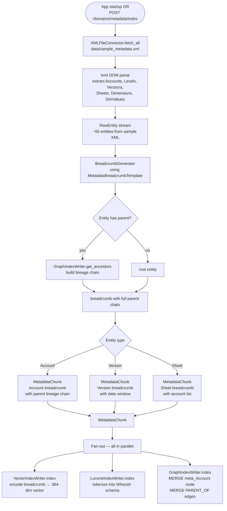
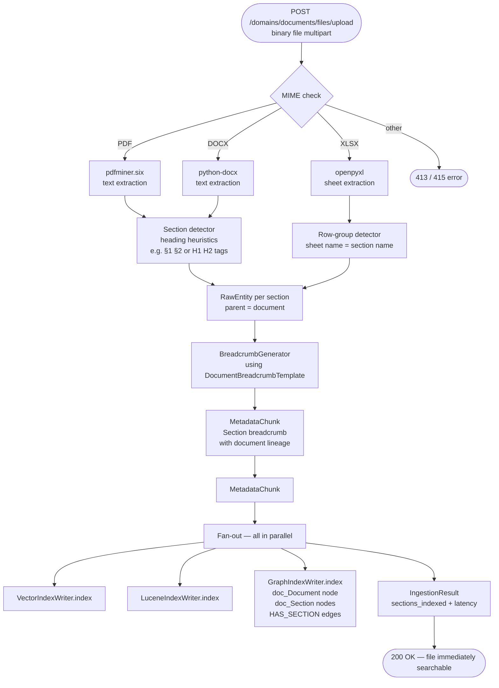
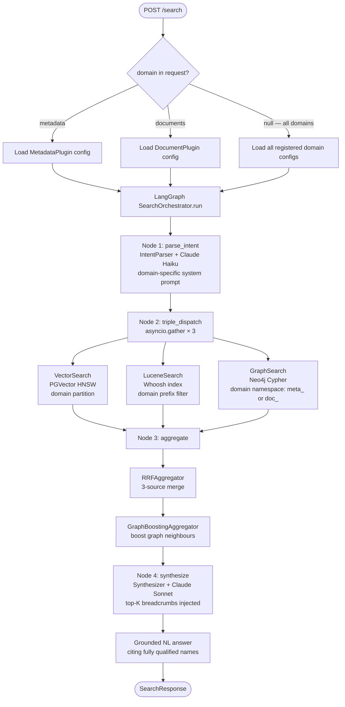

# MVP 02 — High-Level Design

---

## 1. Two Domain Plugins at a Glance

```
MetadataPlugin                    DocumentPlugin
───────────────────────                    ──────────────
domain_id: metadata              domain_id: documents
source:    XMLFileConnector                source:    FileSystemConnector
trigger:   startup + POST /index           trigger:   POST /upload (immediate)

Entities:                                  Entities:
  Account  (3-level hierarchy)               Document
  Level                                      Section
  Version
  Sheet                                    Graph:
  Dimension                                  doc_Document -[HAS_SECTION]-> doc_Section
  DimValue                                   doc_Document -[SUPERSEDES]-> doc_Document
                                             doc_Document -[TAGGED_WITH]-> doc_Tag
Graph:
  meta_Account -[PARENT_OF]-> meta_Account    Breadcrumb template:
  meta_Account -[LINKED_TO]-> meta_Account      [Title §N] | Section | doc:[DocTitle] |
  meta_Sheet -[INCLUDES_ACCOUNT]->              [Summary] | owner=[X]; effective=[Y]
    meta_Account
  meta_Sheet -[USES_VERSION]-> meta_Version   Intent emphasis:
  meta_Sheet -[USES_LEVEL]-> meta_Level         Policy text → Vector primary
  meta_Dimension -[HAS_VALUE]-> meta_DimValue   Exact policy codes → Lucene primary
                                            "sections of doc X" → Graph primary
Breadcrumb template:
  [Code] | [Type] | parent:[P] > [GP] |
  [Description] | [key attributes]

Intent emphasis:
  Business terms → Vector primary
  Exact codes (SAAS_REVENUE) → Lucene primary
  "children of X", "what's in sheet Y" → Graph primary
```

---

## 2. Write Path — Metadata



---

## 3. Write Path — Document Upload



---

## 4. Read Path — Both Domains



---

## 5. Concrete Query Examples

### Metadata Queries

| Query | Type | Leading Index | Example Result |
|---|---|---|---|
| "show me recurring revenue accounts" | DISCOVERY | Vector | SAAS_REVENUE, PROD_REVENUE |
| "SAAS_REVENUE" | LOOKUP | Lucene | SAAS_REVENUE breadcrumb (exact) |
| "children of REVENUE" | TRAVERSAL | Graph | PROD_REVENUE, SVC_REVENUE |
| "what accounts are in PL_Summary?" | TRAVERSAL | Graph | REVENUE, COGS, GROSS_PROFIT, OPEX, NET_INCOME |
| "budget versions" | DISCOVERY | Vector | BUDGET, Q2_FORECAST |

### Document Queries

| Query | Type | Leading Index | Example Result |
|---|---|---|---|
| "capital expenditure approval" | DISCOVERY | Vector | CapEx Policy §4.2 |
| "CapEx Policy Rev3" | LOOKUP | Lucene | Exact document match |
| "sections of the expense policy" | TRAVERSAL | Graph | All HAS_SECTION children |
| "vendor onboarding procedures" | DISCOVERY | Vector | Procurement Policy §2, Vendor Guide §1 |

---

## 6. Aggregation in MVP

```
3 result lists enter AggregationPipeline:
  vector_results  (up to 10) ─┐
  lucene_results  (up to 10) ─┤→ RRFAggregator → rrf_merged (top 10)
  graph_results   (up to 10) ─┘

rrf_merged → GraphBoostingAggregator
  Takes top-3 Lucene results, fetches 1-hop graph neighbours
  Boosts neighbours found in rrf_merged by 1.5×

Final top-K → Synthesizer (Claude Sonnet)
  System prompt: "Answer ONLY using the provided breadcrumbs."
  Response cites: fully qualified name + domain path
```

---

## 7. Synthesis Output Format

### Metadata Answer

```
Found 3 relevant accounts for "recurring revenue":

1. SAAS_REVENUE (Account › PROD_REVENUE › REVENUE)
   SaaS Subscription Revenue tracking ARR/MRR.
   Billing: recurring_monthly. Metric: arr.
   Found in: Revenue_Detail sheet (ACTUAL, BUDGET, Q2_FORECAST versions).

2. PROD_REVENUE (Account › REVENUE)
   Total Product Revenue. Parent of SAAS_REVENUE and LICENSE_REVENUE.

3. LICENSE_REVENUE (Account › PROD_REVENUE › REVENUE)
   Perpetual License Revenue. Billing: one_time. Metric: tlv.

Sources: metadata index (vector + lucene + graph)
```

### Document Answer

```
Found the capital expenditure approval policy:

CapEx Policy Rev3 §4.2 — Approval Thresholds (Policy Section)
Document: Capital Expenditure Policy Rev3
Owner: CFO Office | Effective: 2026-01-01

"Any capital expenditure over $50,000 requires CFO sign-off
within 5 business days of submission."

Related sections in the same document:
• §4.1 — CapEx Definition and Scope
• §4.3 — Expedited Approval Process

Sources: documents index (vector + lucene + graph)
```
