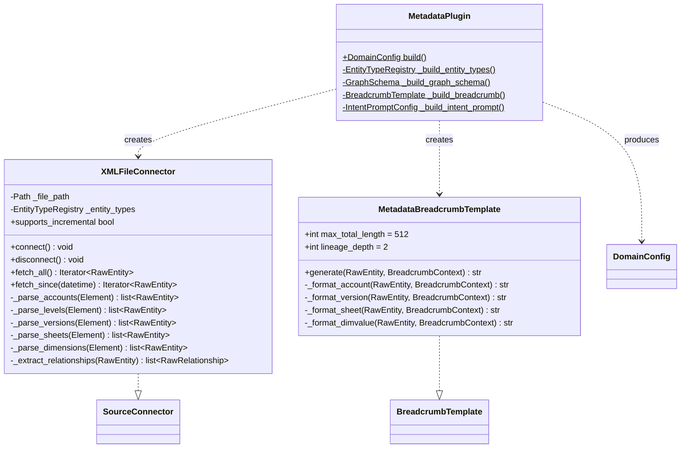
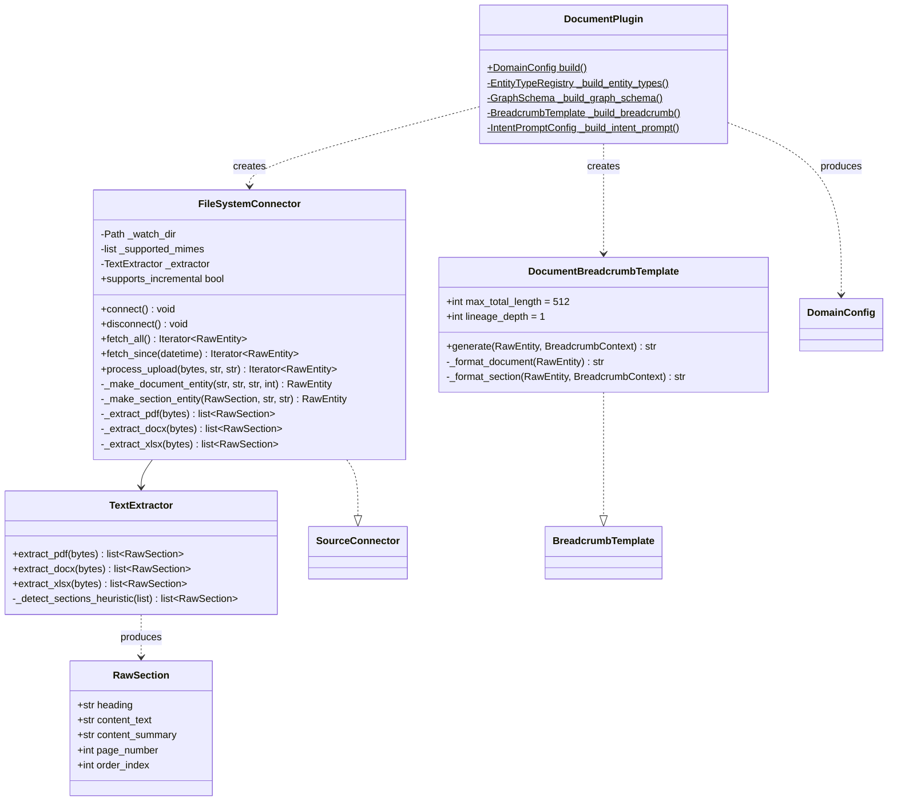
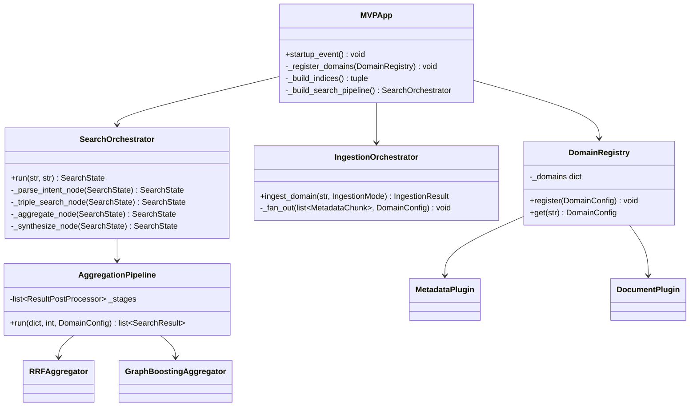
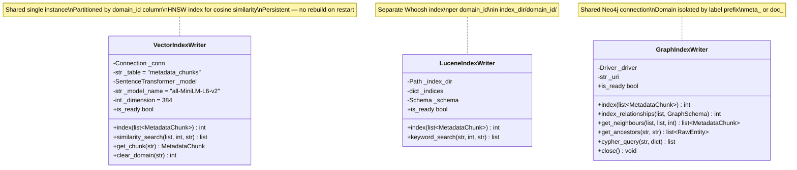
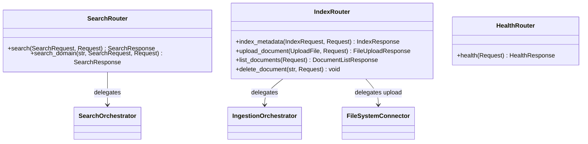

# MVP 05 — Class Diagrams

---

## 1. MetadataPlugin

```mermaid
classDiagram
    class MetadataPlugin {
        +DomainConfig build() $
        -EntityTypeRegistry _build_entity_types()$
        -GraphSchema _build_graph_schema()$
        -BreadcrumbTemplate _build_breadcrumb()$
        -IntentPromptConfig _build_intent_prompt()$
    }

    class XMLFileConnector {
        -Path _file_path
        -EntityTypeRegistry _entity_types
        +connect() void
        +disconnect() void
        +fetch_all() Iterator~RawEntity~
        +fetch_since(datetime) Iterator~RawEntity~
        -_parse_accounts(Element) list~RawEntity~
        -_parse_levels(Element) list~RawEntity~
        -_parse_versions(Element) list~RawEntity~
        -_parse_sheets(Element) list~RawEntity~
        -_parse_dimensions(Element) list~RawEntity~
        -_extract_relationships(RawEntity) list~RawRelationship~
        +supports_incremental bool
    }

    class MetadataBreadcrumbTemplate {
        +int max_total_length = 512
        +int lineage_depth = 2
        +generate(RawEntity, BreadcrumbContext) str
        -_format_account(RawEntity, BreadcrumbContext) str
        -_format_version(RawEntity, BreadcrumbContext) str
        -_format_sheet(RawEntity, BreadcrumbContext) str
        -_format_dimvalue(RawEntity, BreadcrumbContext) str
    }

    MetadataPlugin ..> XMLFileConnector : creates
    MetadataPlugin ..> MetadataBreadcrumbTemplate : creates
    MetadataPlugin ..> DomainConfig : produces
    XMLFileConnector ..|> SourceConnector
    MetadataBreadcrumbTemplate ..|> BreadcrumbTemplate
```

---

## 2. DocumentPlugin

```mermaid
classDiagram
    class DocumentPlugin {
        +DomainConfig build() $
        -EntityTypeRegistry _build_entity_types()$
        -GraphSchema _build_graph_schema()$
        -BreadcrumbTemplate _build_breadcrumb()$
        -IntentPromptConfig _build_intent_prompt()$
    }

    class FileSystemConnector {
        -Path _watch_dir
        -list _supported_mimes
        -TextExtractor _extractor
        +connect() void
        +disconnect() void
        +fetch_all() Iterator~RawEntity~
        +fetch_since(datetime) Iterator~RawEntity~
        +process_upload(bytes, str, str) Iterator~RawEntity~
        -_make_document_entity(str, str, str, int) RawEntity
        -_make_section_entity(RawSection, str, str) RawEntity
        -_extract_pdf(bytes) list~RawSection~
        -_extract_docx(bytes) list~RawSection~
        -_extract_xlsx(bytes) list~RawSection~
        +supports_incremental bool
    }

    class TextExtractor {
        +extract_pdf(bytes) list~RawSection~
        +extract_docx(bytes) list~RawSection~
        +extract_xlsx(bytes) list~RawSection~
        -_detect_sections_heuristic(list) list~RawSection~
    }

    class RawSection {
        +str heading
        +str content_text
        +str content_summary
        +int page_number
        +int order_index
    }

    class DocumentBreadcrumbTemplate {
        +int max_total_length = 512
        +int lineage_depth = 1
        +generate(RawEntity, BreadcrumbContext) str
        -_format_document(RawEntity) str
        -_format_section(RawEntity, BreadcrumbContext) str
    }

    DocumentPlugin ..> FileSystemConnector : creates
    DocumentPlugin ..> DocumentBreadcrumbTemplate : creates
    DocumentPlugin ..> DomainConfig : produces
    FileSystemConnector ..|> SourceConnector
    FileSystemConnector --> TextExtractor
    TextExtractor ..> RawSection : produces
    DocumentBreadcrumbTemplate ..|> BreadcrumbTemplate
```

---

## 3. Engine Wiring — MVP Startup

```mermaid
classDiagram
    class MVPApp {
        +startup_event() void
        -_register_domains(DomainRegistry) void
        -_build_indices() tuple
        -_build_search_pipeline() SearchOrchestrator
    }

    class DomainRegistry {
        +register(DomainConfig) void
        +get(str) DomainConfig
        -_domains dict
    }

    class IngestionOrchestrator {
        +ingest_domain(str, IngestionMode) IngestionResult
        -_fan_out(list~MetadataChunk~, DomainConfig) void
    }

    class SearchOrchestrator {
        +run(str, str) SearchState
        -_parse_intent_node(SearchState) SearchState
        -_triple_search_node(SearchState) SearchState
        -_aggregate_node(SearchState) SearchState
        -_synthesize_node(SearchState) SearchState
    }

    class AggregationPipeline {
        -list~ResultPostProcessor~ _stages
        +run(dict, int, DomainConfig) list~SearchResult~
    }

    MVPApp --> DomainRegistry
    MVPApp --> IngestionOrchestrator
    MVPApp --> SearchOrchestrator
    SearchOrchestrator --> AggregationPipeline
    AggregationPipeline --> RRFAggregator
    AggregationPipeline --> GraphBoostingAggregator
    DomainRegistry --> MetadataPlugin
    DomainRegistry --> DocumentPlugin
```

---

## 4. Index Writers — MVP Instances

```mermaid
classDiagram
    class VectorIndexWriter {
        -Connection _conn
        -str _table = "metadata_chunks"
        -SentenceTransformer _model
        -str _model_name = "all-MiniLM-L6-v2"
        -int _dimension = 384
        +index(list~MetadataChunk~) int
        +similarity_search(list, int, str) list
        +get_chunk(str) MetadataChunk
        +clear_domain(str) int
        +is_ready bool
    }

    class LuceneIndexWriter {
        -Path _index_dir
        -dict _indices
        -Schema _schema
        +index(list~MetadataChunk~) int
        +keyword_search(str, int, str) list
        +is_ready bool
    }

    class GraphIndexWriter {
        -Driver _driver
        -str _uri
        +index(list~MetadataChunk~) int
        +index_relationships(list, GraphSchema) int
        +get_neighbours(list, list, int) list~MetadataChunk~
        +get_ancestors(str, str) list~RawEntity~
        +cypher_query(str, dict) list
        +close() void
        +is_ready bool
    }

    note for VectorIndexWriter "Shared single instance\nPartitioned by domain_id column\nHNSW index for cosine similarity\nPersistent — no rebuild on restart"
    note for LuceneIndexWriter "Separate Whoosh index\nper domain_id\nin index_dir/domain_id/"
    note for GraphIndexWriter "Shared Neo4j connection\nDomain isolated by label prefix\nmeta_ or doc_"
```

---

## 5. API Layer

```mermaid
classDiagram
    class SearchRouter {
        +search(SearchRequest, Request) SearchResponse
        +search_domain(str, SearchRequest, Request) SearchResponse
    }

    class IndexRouter {
        +index_metadata(IndexRequest, Request) IndexResponse
        +upload_document(UploadFile, Request) FileUploadResponse
        +list_documents(Request) DocumentListResponse
        +delete_document(str, Request) void
    }

    class HealthRouter {
        +health(Request) HealthResponse
    }

    SearchRouter --> SearchOrchestrator : delegates
    IndexRouter --> IngestionOrchestrator : delegates
    IndexRouter --> FileSystemConnector : delegates upload
```
