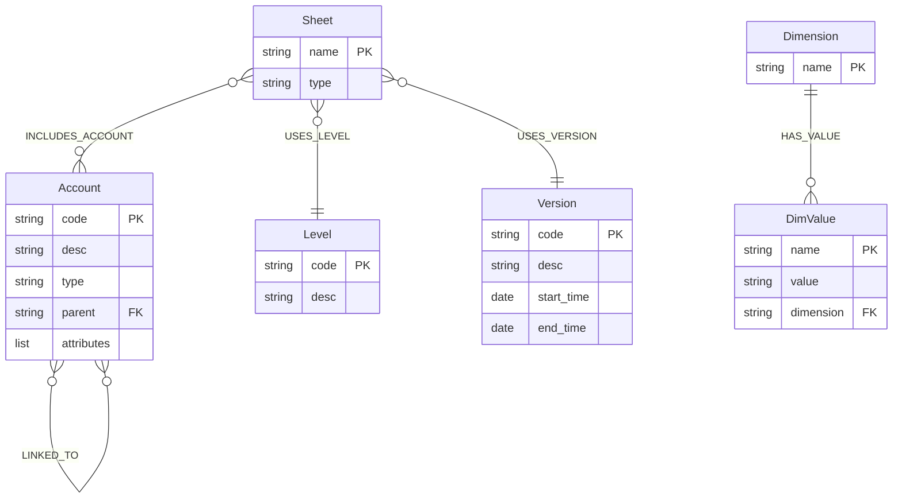
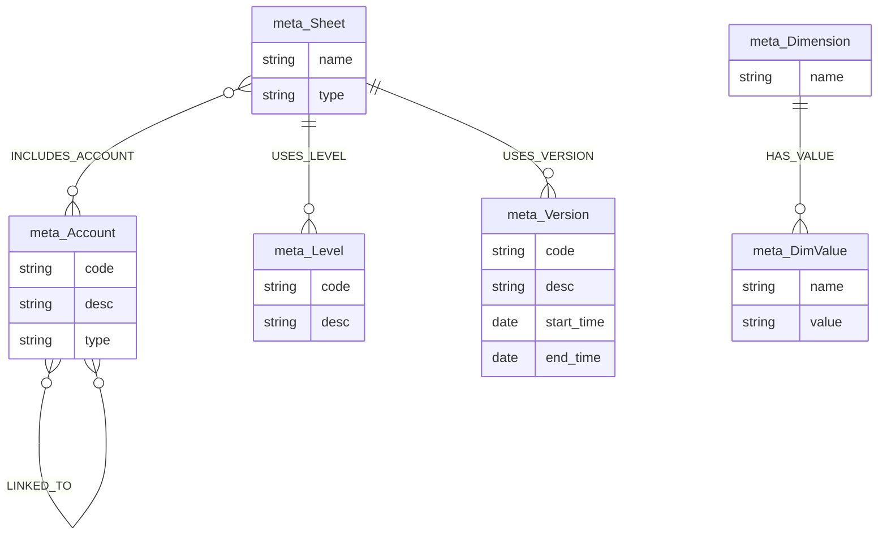
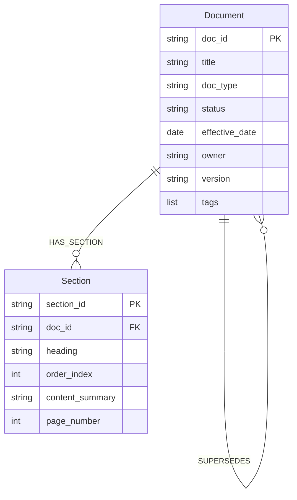
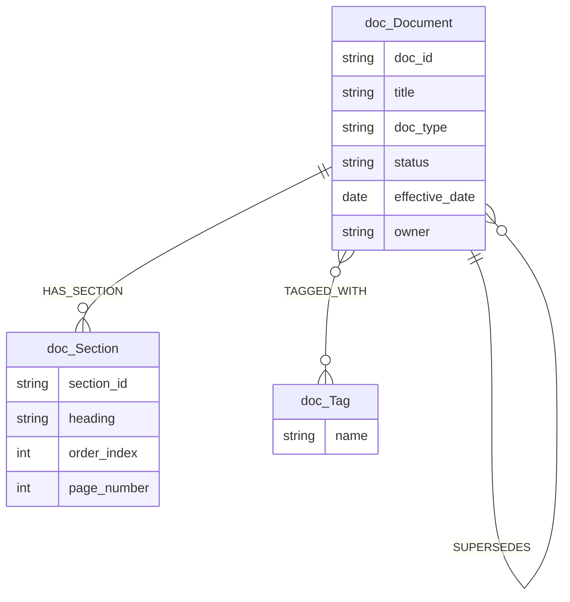
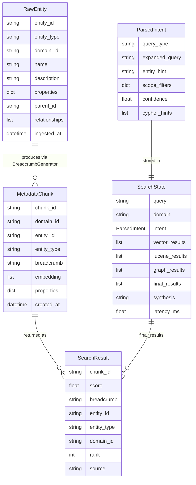
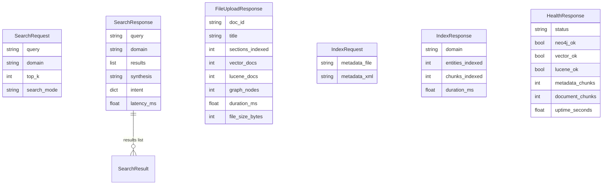
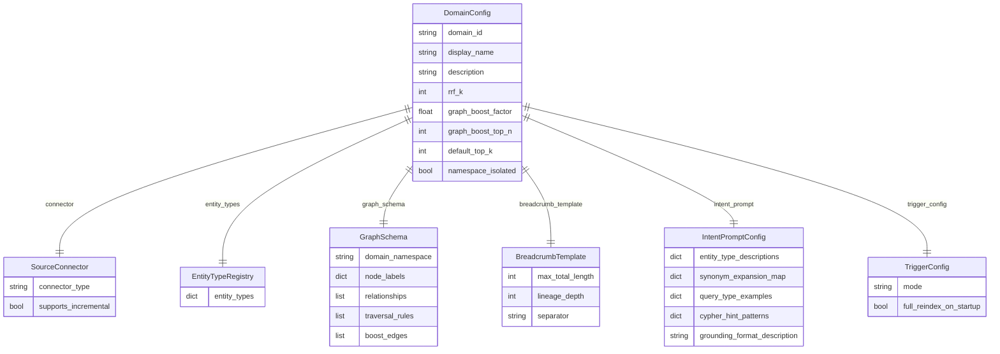

# MVP 06 — Entity Diagrams

---

## 1. Metadata — Core Entity Model



Concrete sample data from `sample_metadata.xml`:

```
Accounts:     REVENUE → PROD_REVENUE → SAAS_REVENUE / LICENSE_REVENUE
              REVENUE → SVC_REVENUE
              COGS → DIRECT_MATERIAL → RAW_MATERIALS / SUPPLIES
              COGS → DIRECT_LABOR → MFG_LABOR / CONTRACT_LABOR
              GROSS_PROFIT (formula: REVENUE - COGS)
              NET_INCOME   (formula: GROSS_PROFIT - OPEX)

Linked pairs: REVENUE ↔ COGS, GROSS_PROFIT ↔ OPEX, SAAS_REVENUE ↔ HC_EXPENSE

Versions:     ACTUAL (2026-Q1), BUDGET (FY2026), Q2_FORECAST

Levels:       CORPORATE, DIVISION, DEPARTMENT

Sheets:       PL_Summary (standard), Revenue_Detail (cube), COGS_Detail (standard)

Dimensions:   Region → NA / EMEA / APAC
              Product → ENTERPRISE / SMB / STARTUP
              Department → ENGINEERING / SALES / MARKETING / FINANCE / OPS
```

---

## 2. Metadata — Neo4j Graph Model



Neo4j label prefix `meta_` isolates all metadata nodes from the documents domain.
All writes use Cypher `MERGE` — safe for re-indexing without duplicate nodes.

---

## 3. Document Domain — Core Entity Model



Concrete breadcrumb examples:

```
Capital Expenditure Policy Rev3 | Document | Financial Policies |
  Corporate CapEx approval policy | owner=CFO Office; effective=2026-01-01; published

CapEx Policy Rev3 §4.2 | Section | doc:Capital Expenditure Policy Rev3 |
  Any CapEx over $50k requires CFO sign-off within 5 days | owner=CFO Office; page=8
```

---

## 4. Document Domain — Neo4j Graph Model



Neo4j label prefix `doc_` isolates document nodes from the metadata domain.
`SUPERSEDES` enables lineage queries: "what did this policy replace?"
`TAGGED_WITH` enables tag-based graph traversal.

---

## 5. Core Data Models — System-Wide Flow

These models flow through the ingestion and search pipelines across both domains.



---

## 6. API Request / Response Models



---

## 7. Domain Config Composition


