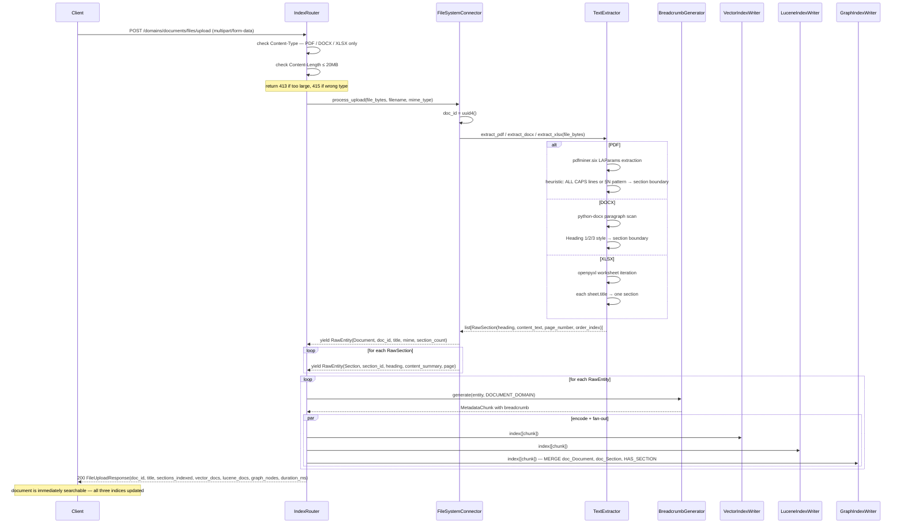
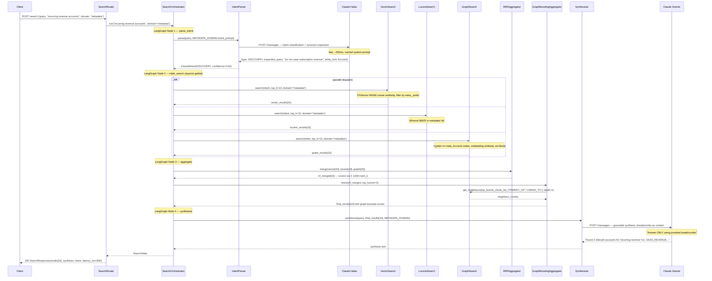
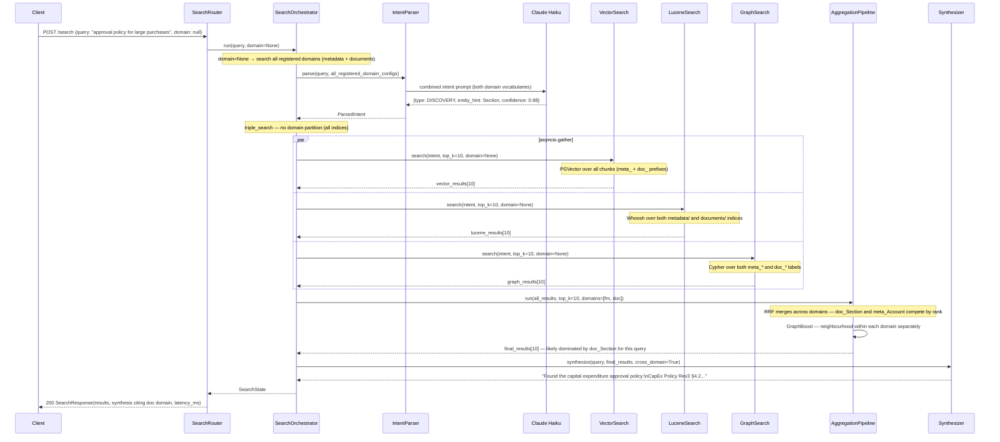

# MVP 07 — Sequence Diagrams

---

## 1. App Startup — Metadata Auto-Index

```mermaid
sequenceDiagram
    participant App as main.py
    participant GI as GraphIndexWriter
    participant VI as VectorIndexWriter
    participant LI as LuceneIndexWriter
    participant Reg as DomainRegistry
    participant IO as IngestionOrchestrator
    participant XML as XMLFileConnector
    participant BG as BreadcrumbGenerator
    participant Neo4j

    App->>GI: GraphIndexWriter(uri, user, password)
    GI->>Neo4j: bolt://neo4j:7687 connect
    Neo4j-->>GI: connected
    App->>VI: VectorIndexWriter(model="all-MiniLM-L6-v2")
    Note over VI: loads model ~80MB, opens PGVector connection, creates HNSW schema
    App->>LI: LuceneIndexWriter(index_dir=./data/whoosh)
    Note over LI: creates metadata/ and documents/ subdirectories

    App->>Reg: DomainRegistry.get_instance()
    App->>Reg: register(METADATA_DOMAIN)
    App->>Reg: register(DOCUMENT_DOMAIN)

    App->>IO: IngestionOrchestrator(registry, vi, li, gi, bg)
    App->>IO: ingest_domain("metadata", IngestionMode.FULL)
    IO->>VI: clear domain partition "metadata"
    IO->>LI: wipe metadata index dir
    IO->>XML: fetch_all()

    loop for each RawEntity (~50 from sample_metadata.xml)
        XML-->>IO: RawEntity (Account / Version / Sheet / Level / Dimension / DimValue)
        IO->>BG: generate(entity, METADATA_DOMAIN)
        BG->>GI: get_ancestors(entity_id, domain) — for lineage in breadcrumb
        GI-->>BG: ancestor chain
        BG-->>IO: MetadataChunk(breadcrumb, embedding=None)
        par encode + fan-out
            IO->>VI: index([chunk]) — encode breadcrumb → 384-dim vector
            IO->>LI: index([chunk]) — tokenize into Whoosh schema
            IO->>GI: index([chunk]) — MERGE meta_* node
        end
    end

    IO->>GI: index_relationships(raw_entities, METADATA_GRAPH_SCHEMA)
    Note over GI: MERGE PARENT_OF, LINKED_TO, INCLUDES_ACCOUNT, etc.
    IO-->>App: IngestionResult(entities=50, chunks=50, graph_nodes=50, ms=...)
    Note over App: metadata domain ready; documents domain empty (no startup ingest)
```

---

## 2. File Upload → Immediate Indexing



---

## 3. Search — Single Domain (Metadata)



---

## 4. Search — Full Scope (domain = null)



---

## 5. Re-Index Metadata (Manual Trigger)

```mermaid
sequenceDiagram
    participant Admin
    participant Router as IndexRouter
    participant IO as IngestionOrchestrator
    participant VI as VectorIndexWriter
    participant LI as LuceneIndexWriter
    participant GI as GraphIndexWriter
    participant XML as XMLFileConnector
    participant BG as BreadcrumbGenerator

    Admin->>Router: POST /domains/metadata/index
    Note over Router: optional body: {metadata_file: path} or {metadata_xml: raw_string}

    Router->>VI: clear_domain("metadata")
    Note over VI: deletes all chunks with domain_id='metadata' from PGVector table
    Router->>LI: wipe_index("metadata")
    Note over LI: deletes metadata/ Whoosh directory and recreates schema
    Note over GI: Neo4j uses MERGE — no wipe needed; stale nodes left in place

    Router->>IO: ingest_domain("metadata", IngestionMode.FULL)
    IO->>XML: fetch_all() — or fetch from supplied path/string

    loop each RawEntity
        XML-->>IO: RawEntity
        IO->>BG: generate(entity, METADATA_DOMAIN)
        BG-->>IO: MetadataChunk
        par fan-out
            IO->>VI: index([chunk])
            IO->>LI: index([chunk])
            IO->>GI: index([chunk]) — MERGE, idempotent
        end
    end

    IO->>GI: index_relationships(entities, METADATA_GRAPH_SCHEMA)
    IO-->>Router: IngestionResult(entities=N, chunks=N, duration_ms=...)
    Router-->>Admin: 200 IndexResponse(domain="metadata", entities_indexed=N, chunks_indexed=N, duration_ms=...)
```

---

## 6. LLM Fallback — Intent Heuristic

```mermaid
sequenceDiagram
    participant SO as SearchOrchestrator
    participant IP as IntentParser
    participant LLM as Claude Haiku
    participant HF as HeuristicFallback

    SO->>IP: parse(query="SAAS_REVENUE", domain_config)
    IP->>LLM: POST /messages (intent prompt)
    
    alt LLM timeout or API error
        LLM-->>IP: ConnectTimeout / APIError
        IP->>HF: heuristic_fallback(query)
        HF->>HF: ALL_CAPS regex — [A-Z][A-Z0-9_]{2,}
        Note over HF: "SAAS_REVENUE" matches → LOOKUP
        HF-->>IP: ParsedIntent(LOOKUP, confidence=0.0, entity_hint=None)
    else LLM succeeds but confidence < 0.7
        LLM-->>IP: {type: DISCOVERY, confidence: 0.45}
        IP->>HF: heuristic_fallback(query)
        HF->>HF: no ALL_CAPS match; no traversal keywords
        Note over HF: "SAAS_REVENUE" ALL_CAPS pattern → LOOKUP
        HF-->>IP: ParsedIntent(LOOKUP, confidence=0.0)
    else LLM succeeds, confidence >= 0.7
        LLM-->>IP: {type: LOOKUP, confidence: 0.91}
        IP-->>SO: ParsedIntent(LOOKUP, confidence=0.91) — LLM result used
    end

    IP-->>SO: ParsedIntent — search continues regardless of path taken
    Note over SO: confidence=0.0 signals heuristic was used; search still runs
```
