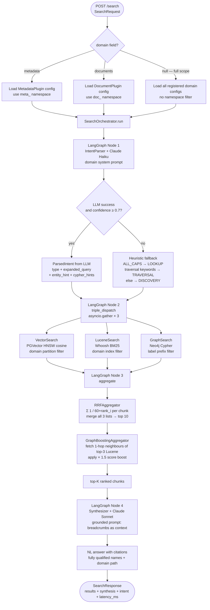
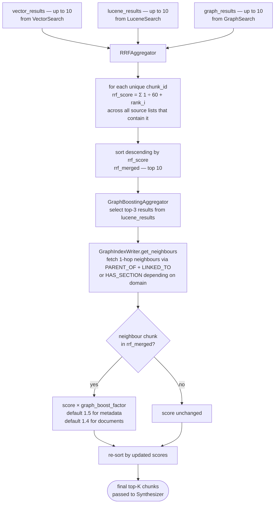
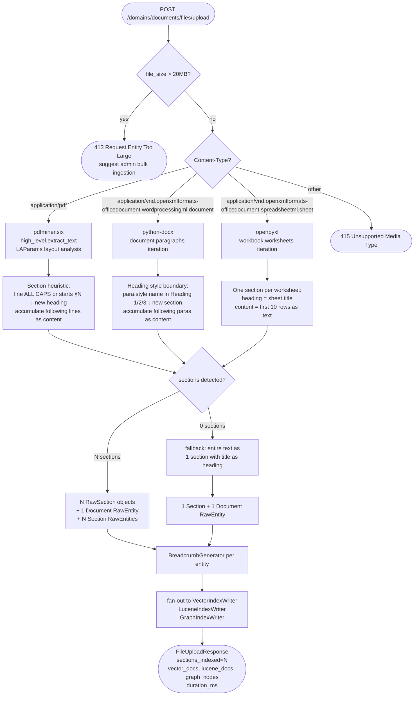

# MVP 08 — Flow Diagrams

---

## 1. MVP Write Path — Dual Branch

```mermaid
flowchart TD
    subgraph Branch_A [Branch A — Metadata]
        A1([App Startup or\nPOST /domains/metadata/index]) --> B1[XMLFileConnector.fetch_all\ndata/sample_metadata.xml]
        B1 --> C1[lxml DOM parse\nAccounts / Levels / Versions\nSheets / Dimensions / DimValues]
        C1 --> D1[RawEntity stream ~50 entities]
        D1 --> E1[BreadcrumbGenerator\nMetadataBreadcrumbTemplate]
        E1 --> F1{Has parent?}
        F1 -->|yes| G1[GraphIndexWriter.get_ancestors\nbuild lineage chain]
        F1 -->|no| H1[root entity — no lineage]
        G1 --> I1[MetadataChunk with full breadcrumb]
        H1 --> I1
        I1 --> J1[Fan-out — all parallel]
        J1 --> K1[VectorIndexWriter.index\nencode breadcrumb → 384-dim]
        J1 --> L1[LuceneIndexWriter.index\ntokenize into Whoosh]
        J1 --> M1[GraphIndexWriter.index\nMERGE meta_* nodes + edges]
    end

    subgraph Branch_B [Branch B — Document Upload]
        A2([POST /domains/documents/files/upload\nmultipart binary]) --> B2{Size check}
        B2 -->|over 20MB| ZB([413 Request Entity Too Large])
        B2 -->|ok| C2{MIME type}
        C2 -->|application/pdf| D2[pdfminer.six\ntext + layout extraction]
        C2 -->|DOCX| E2[python-docx\nparagraph style scan]
        C2 -->|XLSX| F2[openpyxl\nworksheet iteration]
        C2 -->|other| ZC([415 Unsupported Media Type])
        D2 --> G2[Section detector\nALL CAPS lines or §N pattern → heading]
        E2 --> H2[Heading 1/2/3 style → boundary]
        F2 --> I2[One section per sheet\nsheet.title = heading]
        G2 --> J2[RawEntity Document\n+ N × RawEntity Section]
        H2 --> J2
        I2 --> J2
        J2 --> K2[BreadcrumbGenerator\nDocumentBreadcrumbTemplate]
        K2 --> L2[Fan-out — all parallel]
        L2 --> M2[VectorIndexWriter.index]
        L2 --> N2[LuceneIndexWriter.index]
        L2 --> O2[GraphIndexWriter.index\ndoc_Document + doc_Section\nHAS_SECTION edges]
    end
```



---

## 2. MVP Read Path — Triple-Dispatch with Domain Filter



---

## 3. Breadcrumb Generation — Metadata

```mermaid
flowchart TD
    A([RawEntity]) --> B{entity_type?}

    B -->|Account| C[identity_slot = code\ntype_slot = Account\nlineage = get_ancestors up to depth 2]
    B -->|Version| D[identity_slot = code\ntype_slot = Version\nlineage = Metadata]
    B -->|Sheet| E[identity_slot = name\ntype_slot = Sheet\nlineage = Metadata]
    B -->|Level| F[identity_slot = code\ntype_slot = Level\nlineage = Metadata]
    B -->|Dimension| G[identity_slot = name\ntype_slot = Dimension\nlineage = Metadata]
    B -->|DimValue| H[identity_slot = name\ntype_slot = DimValue\nlineage = parent Dimension name]

    C --> I[assemble:\ncode | Account | parent:P > GP | desc\n| type; metric=X; billing=Y]
    D --> J[assemble:\ncode | Version | Metadata | desc\n| from:START; to:END]
    E --> K[assemble:\nname | Sheet | Metadata | desc\n| sheettype; accounts:A,B,C; versions:V1,V2]
    F --> L[assemble:\ncode | Level | Metadata | desc]
    G --> M[assemble:\nname | Dimension | Metadata]
    H --> N[assemble:\nname | DimValue | parent:DimName | value]

    I --> O{total length > 512?}
    J --> O
    K --> O
    L --> O
    M --> O
    N --> O

    O -->|yes| P[truncate description slot first\nthen attribute slots right-to-left\npreserve identity + type + lineage]
    O -->|no| Q[use as-is]
    P --> R([MetadataChunk.breadcrumb — max 512 chars])
    Q --> R
```

Concrete examples:

```
SAAS_REVENUE | Account | parent:PROD_REVENUE > REVENUE | SaaS Subscription Revenue (ARR/MRR) | cube; metric=arr; billing=recurring_monthly
ACTUAL       | Version | Metadata             | Actuals – recorded financial results   | from:2026-01-01; to:2026-03-31
PL_Summary   | Sheet   | Metadata             | Standard P&L planning sheet            | standard; accounts:REVENUE,COGS,...
EMEA         | DimValue| parent:Region                  | Europe, Middle East and Africa
```

---

## 4. Breadcrumb Generation — Documents

```mermaid
flowchart TD
    A([RawEntity]) --> B{entity_type?}

    B -->|Document| C[identity_slot = title\ntype_slot = Document\nlineage = doc_type category\ndesc_slot = summary\nattr_slots = owner, effective, status, tags]

    B -->|Section| D[identity_slot = title §N\ntype_slot = Section\nlineage = doc:parent_title\ndesc_slot = content_summary\nattr_slots = owner, page_number]

    C --> E[assemble:\nTitle | Document | Category | Summary\n| owner=X; effective=Y; status]
    D --> F[assemble:\nTitle §N | Section | doc:DocTitle\n| content summary | owner=X; page=N]

    E --> G{total length > 512?}
    F --> G
    G -->|yes| H[truncate content_summary first\nthen tag attributes]
    G -->|no| I[use as-is]
    H --> J([MetadataChunk.breadcrumb])
    I --> J
```

Concrete examples:

```
Capital Expenditure Policy Rev3      | Document | Financial Policies | Corporate CapEx approval policy | owner=CFO Office; effective=2026-01-01; published
CapEx Policy Rev3 §1                 | Section  | doc:Capital Expenditure Policy Rev3 | Scope and definitions for capital expenditure | owner=CFO Office; page=1
CapEx Policy Rev3 §4.2               | Section  | doc:Capital Expenditure Policy Rev3 | Any CapEx over $50k requires CFO sign-off within 5 days | owner=CFO Office; page=8
Expense Reimbursement Policy         | Document | HR Policies | Employee expense submission and reimbursement | owner=HR; effective=2025-07-01; published
Expense Policy §3 — Travel           | Section  | doc:Expense Reimbursement Policy | Economy class for flights under 6 hours | owner=HR; page=5
```

---

## 5. Intent Classification Decision Tree

```mermaid
flowchart TD
    A([query string]) --> B[Build intent prompt\ndomain entity types + synonym map\ncached system prompt]
    B --> C[Claude Haiku API\nmax_tokens=200\ntemperature=0]
    C --> D{API call result?}

    D -->|timeout / error| E[heuristic fallback\nconfidence = 0.0]
    D -->|success| F{confidence ≥ 0.7?}
    F -->|no| E
    F -->|yes| G([Use LLM result\nParsedIntent])

    E --> H{ALL_CAPS regex?\n[A-Z][A-Z0-9_]{2,}}
    H -->|match found| I([LOOKUP intent\nLucene primary\nexact BM25 search])

    H -->|no match| J{traversal keywords?\nchildren of / parent of\nrolls up to / in sheet\ncontains / members of\nancestors / descendants}
    J -->|keyword found| K([TRAVERSAL intent\nGraph primary\nCypher traversal])
    J -->|none found| L([DISCOVERY intent\nVector primary\nsemantic similarity])
```

---

## 6. RRF + Graph Boost Aggregation Pipeline



---

## 7. File Upload — MIME and Extraction Decision Tree


